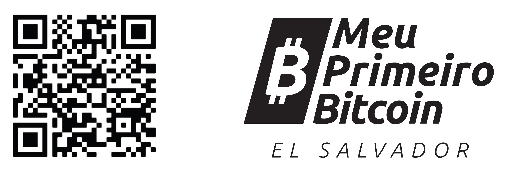

 
 

**_Meu Primeiro Bitcoin_** criou este trabalho e o    
disponibilizou gratuitamente sob a licença **Creative Commons**.    

Este trabalho está licenciado sob a    
**Creative Commons**     
**Attribution-ShareAlike**    
**4.0 International (CC BY-SA 4.0)**    
 
 
 

__________________________________________________________________________________________________________    
    
# Diploma Bitcoin    
    
### _Educação Financeira para a era Bitcoin_    

 
 

### ***Livro do Estudante***    
Versão em Português | Julho de 2023        

 
 
 

***DOE AGORA:***    

 
bc1qc0h5ddd4ln4z05u55l87cp4umg8eg0jjkhcgvf        
      
__________________________________________________________________________________________________________              
           
### Agradecimentos    

     

O Diploma Bitcoin foi um sucesso estrondoso e cresceu mais rápido do que qualquer um esperava. Gostaríamos de dar crédito a todas as pessoas maravilhosas que nos trouxeram até aqui.    

Dalia Platt é a responsável pelo desenvolvimento do currículo e a força motriz por trás do nosso conteúdo desde o início. Ela é uma estrela. Ela contou com uma ótima ajuda para esta edição de alguns contribuidores incríveis, incluindo Madelyn Hereford, Greg Foss, Ronny Avendano, Alejandro Galán, Evelyn Lemus, Gerardo Linares, Marc Platt, Jim Platt, Napoleón Osorio, Victor Yasbek, Robert Malka e Arel Edelkamp. Gloriana Solano, Raul Guirola, Giacomo Zucco, Gerson Martinez, Vriti Saraf e outros apoiaram edições anteriores. Gerardo Apostolo e Enrique Jubis, da ACTIVA, também contribuíram com seu incrível trabalho.     

A história do Diploma Bitcoin começou em fevereiro de 2022 em uma reunião na Escola Pública La Pacheco, em San Marcos, El Salvador. Entre os presentes estavam o diretor inovador da escola, Asael Rodriguez, o defensor da educação sobre o bitcoin e congressista Rodrigo Ayala, e o construtor comunitário do Ibex Mercado, Carlos Toriello, que convidou outros entusiastas do Bitcoin, incluindo eu, para visitar a escola e discutir sobre educação.    

Os primeiros alunos do Diploma Bitcoin começaram em abril, com o apoio inicial do Ibex, bem como centenas de doadores individuais. Em junho, o primeiro grupo de 38 alunos se formou na La Pacheco e começamos a expandir. Com um tremendo apoio de novos doadores e patrocinadores, incluindo a Bitfinex, prefeitos locais e Bitcoin Beach, a matrícula continuou a mais do que dobrar de tamanho a cada dez semanas, uma tendência que nos permitirá alcançar milhares de alunos em todo o país este ano. Em fevereiro de 2023, a entrega do currículo começou na Guatemala, com planos de levá-lo para muitas outras nações antes do final do ano, incluindo Colômbia, Honduras, África do Sul, Equador e Estados Unidos. As doações desses programas subsidiarão ainda mais estudantes em El Salvador.    

O livro de trabalho do Diploma Bitcoin foi disponibilizado como código aberto. Ele está disponível gratuitamente e foi traduzido, impresso e ensinado de forma independente para comunidades ao redor do mundo, da Coreia do Sul ao Uruguai.    

Mi Primer Bitcoin é uma organização sem fins lucrativos com uma missão singular: fornecer educação comunitária de qualidade, independente e imparcial sobre o Bitcoin para todos em El Salvador o mais rápido possível. Como a primeira nação a adotar o Bitcoin, El Salvador será um exemplo para o mundo; cabe a nós decidir que tipo de exemplo será esse. Nossa visão é ensinar uma nação e mudar o mundo. Eu sei que parece loucura, mas acredito que estamos no caminho certo e o Bitcoin Diploma é uma grande parte disso.    

Por um mundo melhor,    

 

**John Dennehy**    
Fundador    
**_Mi Primer Bitcoin_**    
Março 2023
