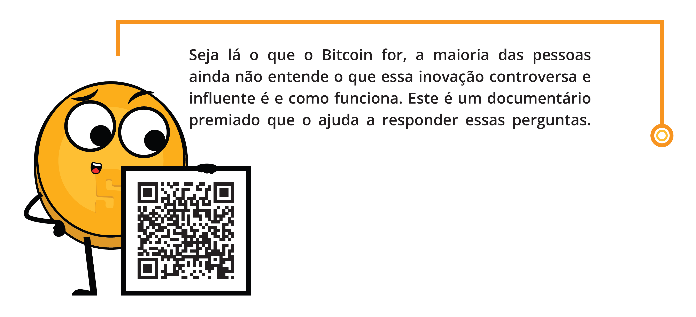

### _Por que Bitcoin?_

**$\color[RGB]{104,60,148} Pensamento \ Crítico. $** Por que o **$\color[RGB]{104,60,148} Bitcoin $** é importante para você e como você acha que ele vai mudar a humanidade?
_________________________________________________________________________________________________________
_________________________________________________________________________________________________________
_________________________________________________________________________________________________________
_________________________________________________________________________________________________________
_________________________________________________________________________________________________________
_________________________________________________________________________________________________________
_________________________________________________________________________________________________________
_________________________________________________________________________________________________________
_________________________________________________________________________________________________________
_________________________________________________________________________________________________________
_________________________________________________________________________________________________________
_________________________________________________________________________________________________________

   

<h2 align="center">Diploma Bitcoin</h2>   

Uma Jornada Transformadora de Dez Semanas Através de Educação Independente, Imparcial, de Qualidade e Gratuita.
    

 

 

_________________________________________________________________________________________________________

É essencial ter um entendimento sólido dos conceitos básicos do dinheiro, sua história e o sistema financeiro atual antes de estudar o **$\color[RGB]{104,60,148} Bitcoin$**. Compreender esses conceitos proporciona uma base sólida para compreender a natureza única e disruptiva do **$\color[RGB]{104,60,148} Bitcoin$**. Ao aprender sobre a evolução do dinheiro, você será capaz de entender melhor o potencial e as limitações do sistema financeiro atual e como o **$\color[RGB]{104,60,148} Bitcoin$** busca abordá-los. Sem essa base, pode ser desafiador apreciar completamente a importância e o impacto potencial do **$\color[RGB]{104,60,148} Bitcoin$**. Confie no processo de aprendizado e mantenha o foco, pois a recompensa de um entendimento mais profundo e uma apreciação desse campo inovador valerá a pena.

  

<em>Uma Mensagem de Nosso Fundador</em>

