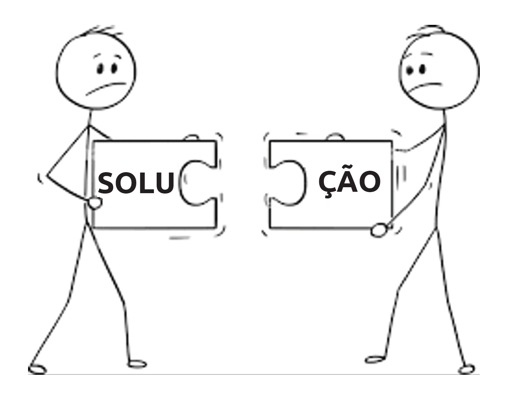
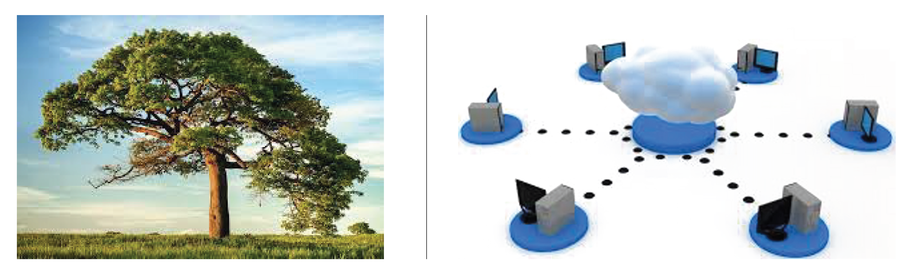
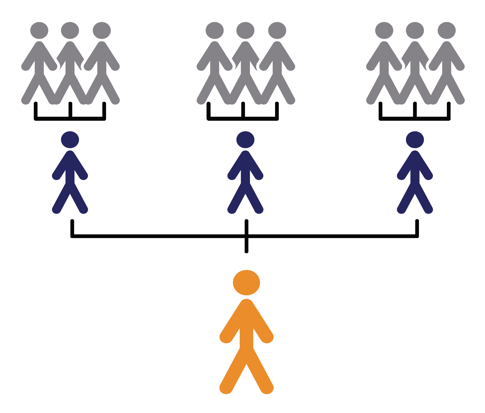
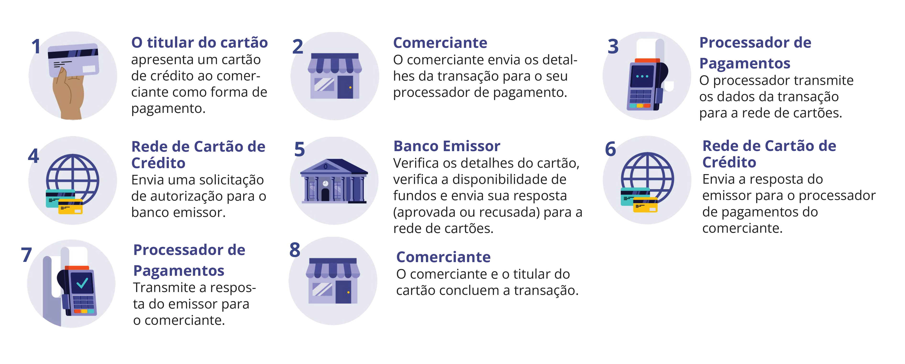
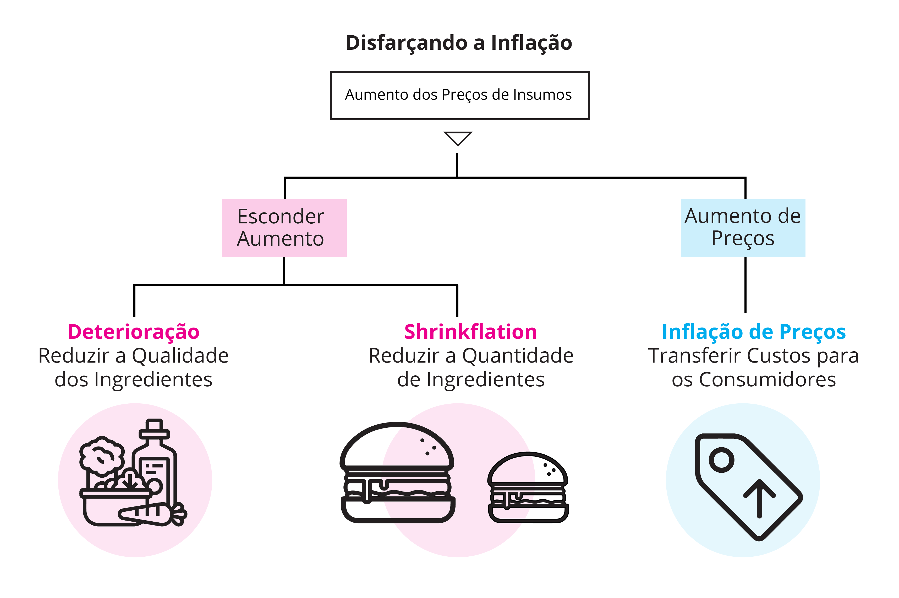
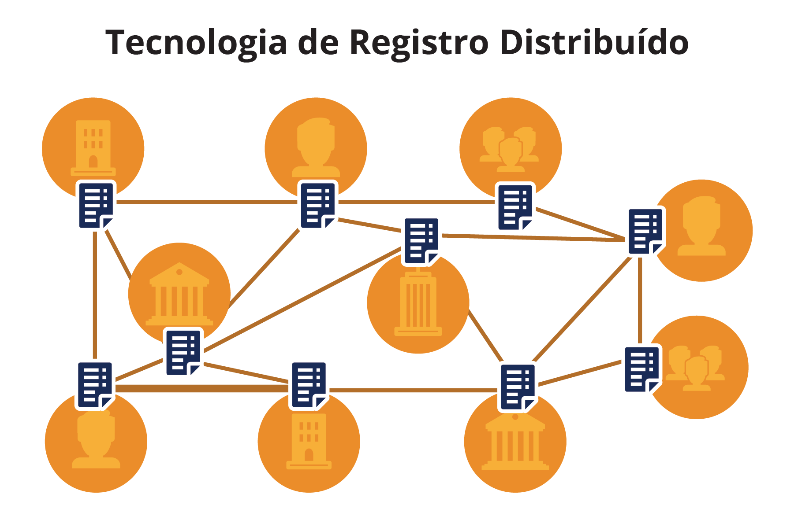
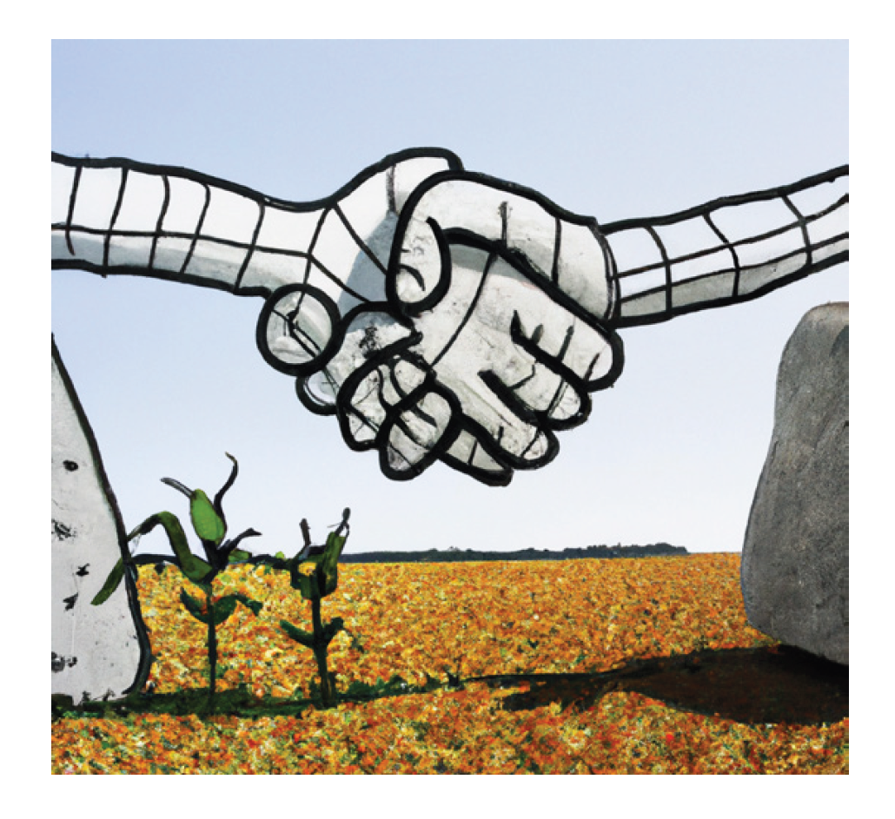
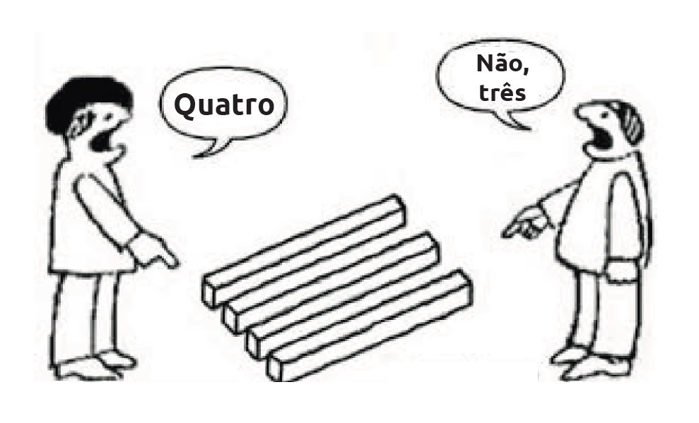
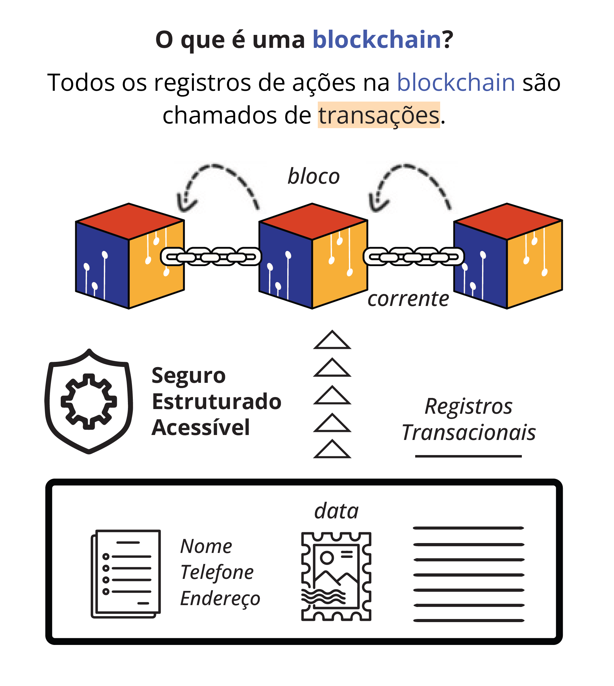

 ## _Capítulo #4_

# ***O Futuro é Descentralizado: Empoderando Comunidades e Indivíduos***

- [**4.0** Da Crise à Inovação: Os Cypherpunks e a Criação de uma Moeda Digital Descentralizada](https://github.com/MyFirstBitcoin/Translation/blob/main/Meu%20Primeiro%20Bitcoin%20-%20Portuguese/2023/Vers%C3%A3o%20web%20do%20Diploma/16.Cap%C3%ADtulo-4.md#40-da-crise-%C3%A0-inova%C3%A7%C3%A3o-os-cypherpunks-e-a-cria%C3%A7%C3%A3o-de-uma-moeda-digital-descentralizada)    
- [**4.1** Abuso da Centralização](https://github.com/MyFirstBitcoin/Translation/blob/main/Meu%20Primeiro%20Bitcoin%20-%20Portuguese/2023/Vers%C3%A3o%20web%20do%20Diploma/16.Cap%C3%ADtulo-4.md#41-abuso-da-centraliza%C3%A7%C3%A3o)    
  - [**4.1.1** Sistemas Centralizados](https://github.com/MyFirstBitcoin/Translation/blob/main/Meu%20Primeiro%20Bitcoin%20-%20Portuguese/2023/Vers%C3%A3o%20web%20do%20Diploma/16.Cap%C3%ADtulo-4.md#411-sistemas-centralizados)    
  - [**4.1.2** Cortando os Intermediários: Uma Visão sobre os Intermediários em uma Transação com Cartão de Crédito](https://github.com/MyFirstBitcoin/Translation/blob/main/Meu%20Primeiro%20Bitcoin%20-%20Portuguese/2023/Vers%C3%A3o%20web%20do%20Diploma/16.Cap%C3%ADtulo-4.md#412-cortando-os-intermedi%C3%A1rios-uma-vis%C3%A3o-sobre-os-intermedi%C3%A1rios-em-uma-transa%C3%A7%C3%A3o-com-cart%C3%A3o-de-cr%C3%A9dito)    
- [**4.2** Uma Ferramenta Poderosa para Superar as Limitações da Centralização](https://github.com/MyFirstBitcoin/Translation/blob/main/Meu%20Primeiro%20Bitcoin%20-%20Portuguese/2023/Vers%C3%A3o%20web%20do%20Diploma/16.Cap%C3%ADtulo-4.md#42-uma-ferramenta-poderosa-para-superar-as-limita%C3%A7%C3%B5es-da-centraliza%C3%A7%C3%A3o)    
  - [**4.2.1** Exercício em Sala de Aula: Jogo de Consenso Descentralizado com Participantes Maliciosos](https://github.com/MyFirstBitcoin/Translation/blob/main/Meu%20Primeiro%20Bitcoin%20-%20Portuguese/2023/Vers%C3%A3o%20web%20do%20Diploma/16.Cap%C3%ADtulo-4.md#421-exerc%C3%ADcio-em-sala-de-aula-jogo-de-consenso-descentralizado-com-atores-maliciosos)    
- [**4.3** Transações são Apenas Acordos para Negociar](https://github.com/MyFirstBitcoin/Translation/blob/main/Meu%20Primeiro%20Bitcoin%20-%20Portuguese/2023/Vers%C3%A3o%20web%20do%20Diploma/16.Cap%C3%ADtulo-4.md#43-transa%C3%A7%C3%B5es-s%C3%A3o-apenas-acordos-de-troca)    
  - [**4.3.1** Confiar ou Não Confiar](https://github.com/MyFirstBitcoin/Translation/blob/main/Meu%20Primeiro%20Bitcoin%20-%20Portuguese/2023/Vers%C3%A3o%20web%20do%20Diploma/16.Cap%C3%ADtulo-4.md#431-confiar-ou-n%C3%A3o-confiar)    
  - [**4.3.2** Vamos Trocar Confiança por Regras](https://github.com/MyFirstBitcoin/Translation/blob/main/Meu%20Primeiro%20Bitcoin%20-%20Portuguese/2023/Vers%C3%A3o%20web%20do%20Diploma/16.Cap%C3%ADtulo-4.md#432-vamos-trocar-confian%C3%A7a-por-regras)    
- [**4.4** Desvendando o Poder do Blockchain: Uma Tecnologia Revolucionando o Futuro](https://github.com/MyFirstBitcoin/Translation/blob/main/Meu%20Primeiro%20Bitcoin%20-%20Portuguese/2023/Vers%C3%A3o%20web%20do%20Diploma/16.Cap%C3%ADtulo-4.md#44-desbloqueando-o-poder-do-blockchain-uma-tecnologia-revolucionando-o-futuro)    

______________________________________________________________________________________________________

### ***4.0 Da Crise à Inovação: Os Cypherpunks e a Criação de uma Moeda Digital Descentralizada***    

Antes da criação do **$\color[RGB]{104,60,148} **Bitcoin** $**, as pessoas estavam em busca de maneiras de lidar com os problemas das finanças tradicionais, como fraude, corrupção e falta de confiança nas instituições financeiras. Essas questões se tornaram ainda mais urgentes devido à crise financeira global de 2008. Em resposta, um grupo de indivíduos habilidosos em tecnologia e com visão de futuro, conhecidos como Cypherpunks, embarcou na missão de criar uma **moeda digital** que pudesse ser utilizada para transações online **sem a necessidade de intermediários** como bancos.

Os Cypherpunks eram rebeldes e visionários que acreditavam no poder da tecnologia para promover mudanças positivas e desafiar estruturas de poder tradicionais. Muitos deles estavam envolvidos em ativismo e questões de liberdades civis, e eles se uniram por uma paixão compartilhada pela tecnologia e o desejo de usá-la para moldar o futuro.

- 💡 **Q**: Como os indivíduos podem recuperar sua autossuficiência financeira?

- 💡 **R**: O movimento Cypherpunks tem como objetivo criar um novo sistema financeiro que respeite a segurança, privacidade e liberdade dos indivíduos, como solução para recuperar a autossuficiência financeira.

E assim, eles se dedicaram a criar o **$\color[RGB]{242,145,0} bitcoin$**, uma moeda digital que revolucionaria a maneira como pensamos sobre dinheiro e transações financeiras. Para isso, eles precisavam encontrar uma forma de registrar transações que fosse mais segura e transparente do que os sistemas tradicionais de registros centralizados. Por que eles sentiram essa necessidade?

 

### ***4.1 Abuso da Centralização***    
### _4.1.1 Sistemas Centralizados_    

A centralização do poder frequentemente leva à corrupção, o que pode resultar na má gestão de recursos, incluindo recursos financeiros. Isso pode afetar de forma desproporcional aqueles que estão em posições inferiores na hierarquia e que possuem menos influência ou poder, fazendo com que eles suportem o maior ônus das consequências da corrupção e má gestão.

O sistema monetário moderno é caracterizado pela centralização do controle, com um pequeno grupo de bancos e outras instituições financeiras detendo um peso significativo sobre a economia.

______________________________________________________________________________________________________

Um sistema centralizado pode ser pensado como uma árvore com um único tronco. O tronco representa a autoridade central ou ponto de controle, e os galhos representam as várias partes do sistema que são controladas pela autoridade central. Nessa analogia, a árvore fica vulnerável se o tronco estiver danificado ou doente, porque toda a árvore depende do tronco para sustentação.

Existem várias **desvantagens nos sistemas centralizados**, incluindo:

- **Vulnerabilidade:** Um sistema centralizado depende de um único ponto, portanto, se esse ponto falhar, todo o sistema pode falhar.
- **Controle e poder:** Aqueles que estão no controle de sistemas centralizados possuem muito poder e influência sobre seu funcionamento.
- **Ineficiência e intermediários:** Sistemas centralizados frequentemente usam intermediários, o que pode torná-los lentos e adicionar custos extras.
- **Falta de autonomia:** As pessoas podem não conseguir tomar suas próprias decisões financeiras.

- **Censura e restrição:** Existe o risco de ser bloqueado ou restrito de acessar determinados recursos financeiros em sistemas centralizados.
- **Desafios de escalabilidade:** Sistemas centralizados podem enfrentar dificuldades em lidar com a crescente demanda por serviços e recursos financeiros.
- **Riscos de segurança:** Sistemas centralizados podem ter vulnerabilidades que hackers podem explorar para obter acesso ou causar danos.
- **Falta de transparência e confiança:** Pode ser difícil entender como os sistemas centralizados funcionam e tomar decisões informadas sobre eles, pois podem não ser transparentes ou confiáveis.

______________________________________________________________________________________________________

### _4.1.2 Cortando os Intermediários: Uma Visão sobre os Intermediários em uma Transação com Cartão de Crédito_    

A banca moderna. Simples, certo? Pegue algo aparentemente simples, como comprar um hambúrguer com um cartão de crédito. À primeira vista, pode parecer fácil e inofensivo. Mas se analisarmos os passos e vermos os intermediários envolvidos, você pode se surpreender com o que descobrimos. Existem inconvenientes, ineficiências, talvez até perigos ocultos espreitando nas sombras? Vamos descobrir.

| Etapa | Transações | Descrições |
| ------------- | ------------- | --------- |
| **1** | Titular do cartão-Comerciante | Você vai ao McDonald’s e pede um hambúrguer usando seu cartão Citi MasterCard. |
| **2** | Comerciante-Processador de Pagamento | O McDonald’s envia uma solicitação de autorização ao seu processador de pagamentos. |
| **3** | Processador de Pagamento - Rede de Cartão de Crédito | O processador recebe a solicitação e a envia para a Mastercard. |
| **4** | Rede de Cartão de Crédito - Banco Emissor | A Mastercard repassa a solicitação ao seu banco emissor, o CitiBank. |
| **5** | Banco Emissor - Rede de Cartão de Crédito | O Citibank verifica se a sua conta está em boa situação e envia o código de autorização de volta para a Mastercard. |
| **6** | Rede de Cartão de Crédito - Processador de Pagamentos | A Mastercard envia a autorização de volta para o processador. |
| **7** | Processador de Pagamentos - Comerciante | O processador envia a autorização de volta para o McDonald’s. |
| **8** | Titular do cartão - Comerciante | Você recebe o seu hambúrguer. |

______________________________________________________________________________________________________

Neste ponto, nenhum fundo real foi trocado, exceto talvez uma **$\color[RGB]{210,34,41} pequena \ taxa \ de \ autorização$**. A transação existe apenas no “papel”. O McDonald’s precisa encerrar ou agrupar suas vendas do dia. O processo de encerramento pode ser assim:

1. O terminal ou sistema de ponto de venda (POS) do McDonald’s envia as transações do dia para o processador.
2. O **$\color[RGB]{115,145,56} processador$** envia as informações da transação para a **$\color[RGB]{221,152,39} Mastercard$**.
3. A **$\color[RGB]{221,152,39} Mastercard$** envia as transações **$\color[RGB]{36,64,143} Citibank$**.
4. O **$\color[RGB]{36,64,143} Citibank$** confirma as autorizações, **$\color[RGB]{210,34,41} retém \ as \ taxas \ de \ intercâmbio$** (existem mais de 900 códigos de taxa possíveis na América do Norte) e transfere os fundos de volta para a **$\color[RGB]{221,152,39} Mastercard$**.
5. A **$\color[RGB]{221,152,39} Mastercard$** **$\color[RGB]{210,34,41} retém \ sua \ taxa \ de \ avaliação$** e envia os fundos para o **$\color[RGB]{115,145,56} processador$**.
6. O **$\color[RGB]{115,145,56} processador$** **$\color[RGB]{210,34,41} retém \ sua \ parte$**, conforme estabelecido no contrato com o comerciante, e deposita os fundos na conta bancária do McDonald’s.

Quem você acha que pagou pelas taxas? Claro, VOCÊ. Mas alguém informou você disso? Ah, não! Eles estavam ocultos no custo do hambúrguer.

E tudo isso acontece, acredite ou não, porque dependemos da centralização.

O mundo bancário moderno apresenta vários riscos, incluindo duplicação acidental de cobranças,
fraude com cartão de crédito, erros humanos e computacionais e possíveis violações de segurança.

______________________________________________________________________________________________________

### ***4.2 Uma Ferramenta Poderosa para Superar as Limitações da Centralização***    

**Os sistemas descentralizados**, por outro lado, podem ser pensados como uma floresta. Cada árvore representa um participante independente, e a floresta representa o sistema como um todo. Nessa analogia, a floresta é mais resiliente do que uma árvore individual, pois não depende de um único ponto de falha. Se uma árvore está danificada ou doente, o resto da floresta pode continuar prosperando. As árvores na floresta compartilham o solo, os nutrientes, o sol e a chuva.

Sistemas descentralizados, assim como comunidades, redes e florestas, funcionam melhor quando há um grupo diversificado de indivíduos trabalhando juntos, em vez de uma única autoridade central ditando todas as regras.

- 💡 Uma **rede** é um grupo de **nós** que estão conectados entre si de alguma forma. Essa conexão permite que os dispositivos troquem informações e se comuniquem uns com os outros.

- 💡 Um **nó** é um computador conectado a uma rede que pode compartilhar e/ou receber informações e se comunicar com os outros nós.

**Vantagens de um sistema descentralizado:**

- É mais resiliente e confiável porque _[não há um único ponto de falha]()_. Se uma parte do sistema falhar, o restante pode continuar operando.
- Com a criptografia adequada, a descentralização é mais _[segura]()_, pois não há um ponto central de controle que possa ser alvo de hackers.

______________________________________________________________________________________________________

- Pode ajudar a obter _[soberania]()_, ou seja, você terá mais controle e autonomia sobre seus próprios ativos e decisões, em vez de depender de uma autoridade central.
- Pode ser mais _[transparente]()_, pois todos os nós têm acesso às mesmas informações e podem ver o que está acontecendo no sistema.
- Pode ser sem _[permissão]()_, o que significa que qualquer pessoa pode ingressar ou participar do sistema sem precisar de permissão de uma autoridade central.
- Pode ser _[ilimitado]()_, ou seja, não há um limite predeterminado para o número de nós que podem ingressar no sistema.
- Cada nó tem _[oportunidades iguais]()_ de contribuir e influenciar a rede, tornando-a uma estrutura mais democrática e inclusiva.
- Os participantes também podem optar por usar pseudônimos ou “apelidos” para _[proteger sua privacidade e segurança]()_, o que pode tornar o sistema mais resistente à censura e ataques.

- 💡 A escassez descentralizada geralmente é vista como algo positivo para o dinheiro, pois impede a inflação e a manipulação por uma autoridade central.

No entanto, os sistemas descentralizados também têm seus **desafios** e limitações.

- Os sistemas descentralizados podem exigir mais trabalho para que todos os dispositivos conectados (nós) concordem e trabalhem juntos.
- Os sistemas descentralizados também podem estar mais propensos a problemas causados por atores ou dispositivos mal-intencionados (nós maliciosos) que possam prejudicar a rede.

### _4.2.1 Exercício em Sala de Aula: Jogo de Consenso Descentralizado com Atores Maliciosos_    

Em uma rede descentralizada, o **consenso** se refere ao processo de alcançar um acordo entre os membros da rede. Isso pode apresentar dificuldades, uma vez que não há uma autoridade central para tomar decisões ou resolver conflitos. Em vez disso, as decisões devem ser tomadas por meio de um processo de negociação e compromisso entre os membros da organização.

**$\color[RGB]{104,60,148} Exercício \ em \ Sala \ de \ Aula.$** Neste jogo, você estará desempenhando o papel de **nós** em uma rede descentralizada. Seu objetivo é chegar a um **consenso** sobre um problema **sem confiar uns nos outros**.

- Você desempenhará o papel de um nó em uma rede descentralizada e trabalhará com outros para chegar a um consenso sobre um problema.
- Pode haver atores maliciosos no grupo que tentarão enganar ou sabotar o processo.
- Como um **bom ator**, seu objetivo é trabalhar com os outros para verificar informações e alcançar o consenso.

______________________________________________________________________________________________________

- Como um **ator malicioso**, seu objetivo é enganar o grupo de forma sutil.
- O propósito do jogo é entender os desafios e benefícios dos sistemas descentralizados, aprender a verificar informações, alcançar consenso e identificar comportamentos maliciosos.
- Vocês serão divididos em pequenos grupos e receberão um problema para resolver dentro de um determinado período de tempo.

Lembre-se de que, **em um sistema descentralizado, você não pode simplesmente confiar nas respostas dos outros membros do grupo**. Você deve verificar a precisão das informações e chegar a um consenso por meio de discussão e colaboração.

### ***4.3 Transações são apenas acordos de troca***    

Bem-vindo _à ilha micronésia **descentralizada** de Yap!_ Ela é um pouco remota, mas fascinante porque as pessoas usam um tipo especial de moeda chamada “pedras Rai”. Uma característica que as torna uma ótima forma de dinheiro é sua **escassez**. O número total de pedras Rai é _limitado_, o que significa que _elas não podem ser facilmente reproduzidas ou infladas_ como as moedas fiduciárias. Essa oferta fixa ajuda a manter o poder de compra das pedras Rai ao longo do tempo e as torna uma reserva confiável de valor. Essas pedras Rai são como moedas gigantes usadas para comprar coisas na ilha. A questão é que elas podem pesar uma _tonelada_. As pedras Rai podem realmente esmagar você, então elas são um pouco impraticáveis de carregar por aí. Como, então, as pessoas podem usar convenientemente as pedras Rai como meio de troca sem ter que transportá-las fisicamente de um lugar para outro?

 

### _4.3.1 Confiar ou não Confiar_    

Embora o dólar americano seja agora a moeda oficial da Ilha de Yap, as pedras Rai ainda são um tipo de dinheiro. Ao contrário dos dólares, as pedras Rai na Ilha de Yap não são controladas por uma única autoridade ou armazenadas em bancos. Em vez disso, as transações são baseadas em história oral e confiança, com as pessoas mantendo o registro próprio de quem possui quais pedras.

Esse sistema tem benefícios e desvantagens. Por um lado, ele permite um certo grau de independência de uma autoridade central. Por outro lado, também pode levar a desacordos e potencial para trapaças. Por quê?

A descentralização é fácil de alcançar em grupos pequenos. A vida é simples, pois há menos pessoas para coordenar; muitas vezes é possível que todos tenham uma opinião nos processos de tomada de decisão e que essas decisões sejam implementadas relativamente rapidamente. À medida que um grupo se torna maior, torna-se mais difícil chegar a um acordo e para que as decisões sejam implementadas efetivamente.

______________________________________________________________________________________________________

- Imagine que você tenha um campo cheio de milho maduro que precisa ser colhido. Você precisa de ajuda, então você aborda sua vizinha, Raquel, e faz uma proposta: se ela ajudar a colher o milho, você dará a ela uma pedra de 10 kg em troca. Raquel concorda, e durante o próximo dia, ela trabalha ao seu lado nos campos, ajudando a colher o milho e trazê-lo para dentro. No final do dia, vocês apertam as mãos e, em vez de entregar fisicamente a pedra, você simplesmente mostra a ela que o pagamento dela (a pedra Rai) está no seu quintal.
- A partir desse momento, _vocês dois concordam_ que a pedra agora pertence a Raquel. Esse tipo de **transação**, em que nenhuma moeda é efetivamente entregue de um indivíduo para o outro como forma de pagamento, mas em vez disso um _objeto físico é usado como **símbolo de valor**_, é comum na Ilha de Yap e tem sido usado há séculos como forma de moeda.

- Cinco anos depois, você decide tentar reivindicar a pedra Rai como sua. Você apresenta evidências para a comunidade de que a pedra foi passada pela sua família por gerações e que você é o legítimo proprietário.

- No entanto, Raquel lembra do acordo que vocês fizeram e fornece evidências trazendo testemunhas da troca para dar um depoimento. Ela argumenta que a pedra pertence legitimamente a ela, pois foi dada a ela em troca de sua ajuda na colheita.
- Alguns membros da comunidade podem concordar com sua reivindicação, citando a tradição e a história de propriedade de sua família da pedra. No entanto, outros podem apoiar Raquel, apontando para o acordo que foi feito e o fato de que a pedra está em posse dela (figurativamente falando) há cinco anos sem objeções de outros membros da comunidade. Fatores que podem ser considerados incluem a história e a tradição da propriedade, os termos do acordo entre você e Raquel e quaisquer evidências ou argumentos relevantes. Não é uma solução muito sólida, não é mesmo?

Então, como milhares de estranhos podem concordar com uma verdade sem que ninguém tenha a palavra final? Isso é algo que tem intrigado as pessoas há muito tempo e é uma questão importante a ser considerada. Acontece que a internet nos ajudou a encontrar uma solução para esse problema. A solução é chamada de **$\color[RGB]{69,90,169} blockchain$**.

 

### _4.3.2 Vamos Trocar Confiança por Regras_    

Imagine que você e seus amigos estão em um chat em grupo onde podem comprar e vender coisas entre si. Sempre que uma compra é feita, ela é registrada em um documento compartilhado para que todos possam ver e o saldo de cada pessoa é atualizado. Esse chat utiliza um livro-razão digital para registrar todas as transações que ocorreram. O livro-razão é como um livro de registros que todos podem ver.

______________________________________________________________________________________________________

Em um sistema descentralizado como esse, todos os participantes têm uma cópia do livro-razão. Isso torna difícil para qualquer pessoa ou grupo alterar qualquer informação sem ser notado. É uma medida de segurança para garantir que os registros sejam precisos e ninguém possa trapacear. Isso é semelhante ao funcionamento de um **$\color[RGB]{69,90,169} blockchain$**.

Em vez de depender de relacionamentos pessoais e interpretações subjetivas de confiança, um sistema descentralizado pode operar de forma eficaz se for _baseado em um conjunto de regras claras e transparentes que todos concordem em seguir_. Dessa forma, _as decisões podem ser tomadas e os conflitos podem ser resolvidos de maneira justa e objetiva, sem depender da confiança das partes envolvidas_. Pode não ser tão romântico quanto depender da confiança, mas é uma forma muito mais confiável de garantir que um sistema descentralizado funcione sem problemas.

- Se a Ilha de Yap tivesse um conjunto de regras inquebráveis e um registro escrito de todas as transações entre seus membros, o conflito entre você e Raquel poderia ter sido evitado. Essas regras e registros teriam deixado claro para todos os membros da vila quais eram seus direitos e responsabilidades.

Mas será que é tão simples assim? Na verdade, não; houve muita tentativa e erro antes que a tecnologia blockchain se tornasse um sucesso de fato.

- Quais são as regras exatas que devem ser seguidas?
- Quem define essas regras?
- Por que as pessoas vão querer seguir as regras?
- Como as regras são distribuídas pela rede?
- O que acontecerá se alguém quebrar as regras?
- Como as regras podem ser alteradas ou atualizadas posteriormente?
- Como as regras serão aplicadas para garantir que todos as sigam?
- Como as regras podem ser tornadas claras e de fácil acesso para todos no sistema?

### ***4.4 Desbloqueando o poder do Blockchain: Uma tecnologia revolucionando o futuro.***    

- 💡 Um **$\color[RGB]{69,90,169} blockchain$** é um livro-razão digital descentralizado que registra e verifica de forma segura todas as transações em vários computadores de maneira transparente.

______________________________________________________________________________________________________

Apesar de inúmeros contratempos, uma pessoa muito enigmática (ou grupo de pessoas) finalmente encontrou a chave para desenvolver uma metodologia revolucionária para o mundo do comércio e finanças. Essa obra-prima tornou incrivelmente fácil rastrear e verificar transações, otimizando o processo de troca de dinheiro, bens e outros ativos. Com sua abordagem inovadora e tecnologia avançada, esse sistema revolucionou a forma como pensamos sobre transações econômicas, tornando-as mais rápidas, seguras e eficientes do que nunca.

Um **$\color[RGB]{69,90,169} blockchain$** é como um livro de história. Cada página (ou “bloco”) tem uma lista de coisas que aconteceram (**transações**). À medida que mais coisas acontecem, precisamos adicionar novas páginas (blocos) ao livro. Qualquer pessoa pode ler o livro gratuitamente, mas apenas ajudantes especiais (**mineradores**) podem adicionar novas páginas. Eles garantem que o que está escrito seja verdadeiro. Uma vez que algo é escrito no livro, não pode ser alterado ou apagado. É um registro permanente de todas as **transações** que ocorreram no **$\color[RGB]{69,90,169} blockchain$**.

- Um **$\color[RGB]{69,90,169} blockchain$** não possui uma autoridade central (como um autor, editor ou editora) que possa editar, apagar ou alterar as informações registradas nele, por isso é considerado um método mais seguro e confiável de registro em comparação com um banco de dados central tradicional.

- 💡 Se os ajudantes (**mineradores**) não chegarem a um **consenso** sobre a validade das páginas (**blocos**), eles serão rejeitados e não serão adicionados ao **$\color[RGB]{69,90,169} blockchain$**.

Para entender o **$\color[RGB]{69,90,169} blockchain$**, precisamos ter uma ideia do contexto em que ele existe. Embora
muitos acreditem que o **$\color[RGB]{69,90,169} blockchain$** tenha usos como uma inovação independente, seu verdadeiro
papel fundador é singular: criar um livro-razão imutável para que uma forma descentralizada e sem
necessidade de confiança de dinheiro exista. Para entender o **$\color[RGB]{69,90,169} blockchain$**, precisamos entender o
**$\color[RGB]{104,60,148} Bitcoin$** como um todo.
