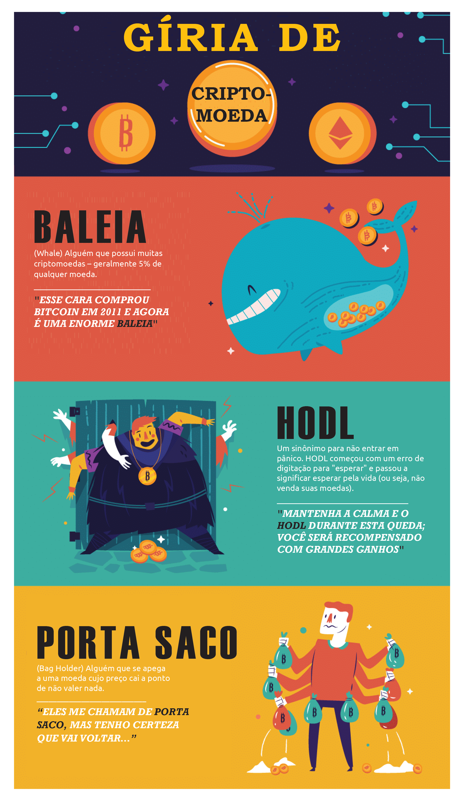
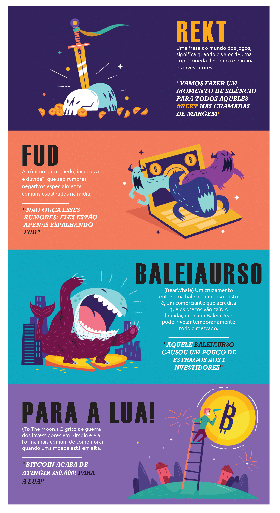
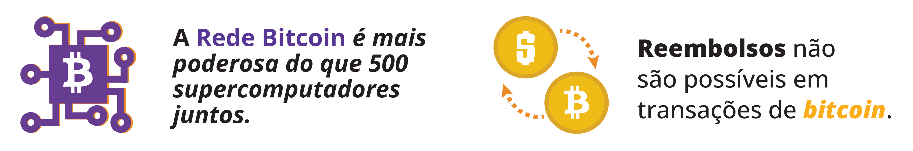
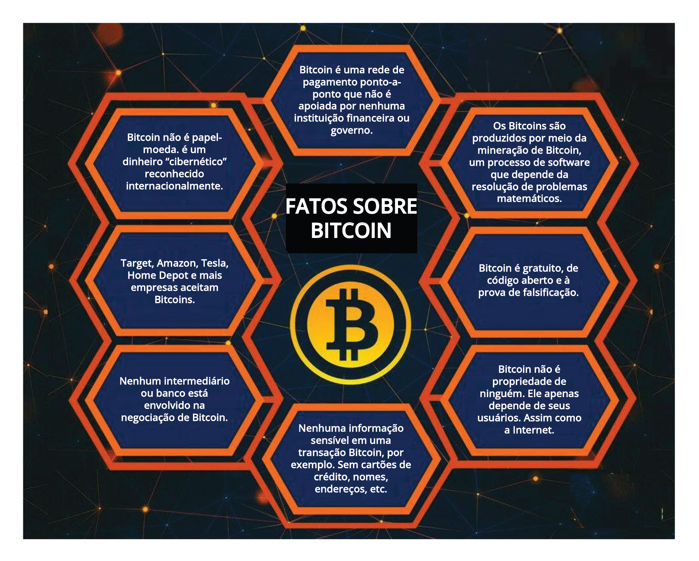
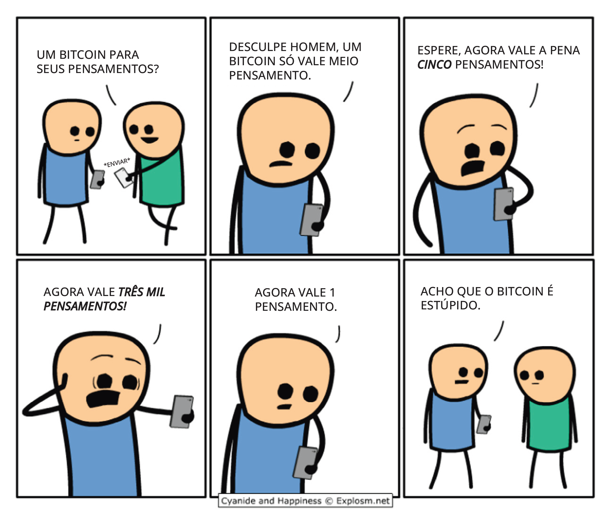
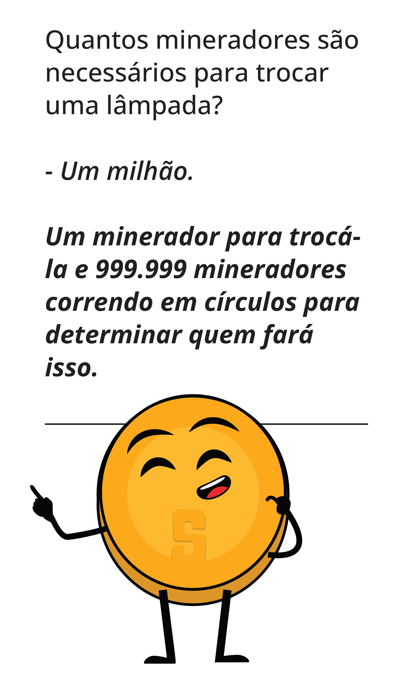

## _Capítulo #10_    

# ***De Bits ao Bitcoin: Montando o Quebra-Cabeça***    

- [**10.0** Apenas Alguns Fatos, Algumas Piadas... e a Linguagem Específica](https://github.com/MyFirstBitcoin/Translation/blob/main/Meu%20Primeiro%20Bitcoin%20-%20Portuguese/2023/Vers%C3%A3o%20web%20do%20Diploma/22.Cap%C3%ADtulo-10.md#100-apenas-alguns-fatos-algumas-piadas-e-o-vocabul%C3%A1rio)    
- [**10.1** Submissão do Projeto Final Mi Primer Bitcoin e Diretrizes de Avaliação](https://github.com/MyFirstBitcoin/Translation/blob/main/Meu%20Primeiro%20Bitcoin%20-%20Portuguese/2023/Vers%C3%A3o%20web%20do%20Diploma/22.Cap%C3%ADtulo-10.md#101-envio-do-projeto-final-meu-primeiro-bitcoin-e-diretrizes-de-avalia%C3%A7%C3%A3o)    

______________________________________________________________________________________________________

### ***10.0 Apenas alguns fatos, algumas piadas... e o vocabulário***    

______________________________________________________________________________________________________

______________________________________________________________________________________________________

### ***10.1 Envio do Projeto Final Meu Primeiro Bitcoin e Diretrizes de Avaliação***

**Introdução:**    
    
O projeto inal do curso **Mi Primer Bitcoin** consiste em um ensaio de 1 a 2 páginas intitulado _“Por que Bitcoin?”_, no qual você será solicitado a explicar o que é o **$\color[RGB]{104,60,148} Bitcoin$**, como ele funciona e de que maneira ele está transformando o mundo hoje.
    
**Requisitos:**    
    
- O ensaio deve ter no mínimo 1 página e no máximo 2 páginas, com espaçamento duplo e fonte tamanho 12.
- O ensaio deve ser escrito em português correto e estar livre de erros gramaticais e ortográficos.
- O ensaio deve incluir introdução, desenvolvimento e conclusão.

**Tópicos a serem abordados:**    
    
- Explique o que é o **$\color[RGB]{104,60,148} Bitcoin$** e sua história.
- Explique como o **$\color[RGB]{104,60,148} Bitcoin$** funciona, incluindo suas características principais, como descentralização, transações e mineração.
- Discuta pelo menos duas maneiras pelas quais o **$\color[RGB]{104,60,148} Bitcoin$** está mudando a forma como o mundo opera hoje. Forneça exemplos e evidências para apoiar sua resposta.

 

**Projeto Alternativo:**    
    
Para aqueles que preferem uma experiência prática, você pode participar da Atividade Final (Simulador de Blockchain Bitcoin) usando a _[Ferramenta de Simulação de Blockchain Bitcoin](https://www.bitcoinsimulator.tk/)_. Aqui você criará uma nova carteira e receberá uma chave privada, que permitirá que você mine um bloco, assine transações, crie uma blockchain privada e execute um ataque de 51%.

 

**Critérios de Avaliação:**    
    
Os seguintes critérios serão usados para avaliar seu projeto final:
- Clareza na explicação do que é o **$\color[RGB]{104,60,148} Bitcoin$** e como ele funciona.
- Uso de exemplos e evidências para apoiar sua resposta.
- Coerência e organização do ensaio.
- Uso adequado de gramática e ortografia.
- Relevância e profundidade da discussão sobre o tópico.

_______________________________________________________________________________________________________

**Envio:**    
O projeto final deve ser enviado em formato Word ou PDF por e-mail ao instrutor do curso até a data limite especificada no programa do curso. Submissões tardias não serão aceitas.

**Conclusão:**    
O projeto final é uma oportunidade para você mostrar seu entendimento sobre o **$\color[RGB]{104,60,148} Bitcoin$** e seu impacto no mundo. O ensaio deve demonstrar sua capacidade de analisar e sintetizar informações e apresentá-las de forma clara e concisa. Boa sorte com seu projeto final!
