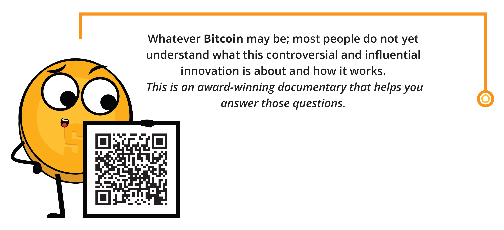

### _Why Bitcoin?_

**$\color[RGB]{104,60,148} **Critical** $** **$\color[RGB]{104,60,148} **Thinking.** $** Why **$\color[RGB]{104,60,148} Bitcoin $** important to you and how do you think it will change humanity?
_________________________________________________________________________________________________________
_________________________________________________________________________________________________________
_________________________________________________________________________________________________________
_________________________________________________________________________________________________________
_________________________________________________________________________________________________________
_________________________________________________________________________________________________________
_________________________________________________________________________________________________________
_________________________________________________________________________________________________________
_________________________________________________________________________________________________________
_________________________________________________________________________________________________________
_________________________________________________________________________________________________________
_________________________________________________________________________________________________________

   

<h2 align="center">Bitcoin Diploma</h2>   

A Ten Week Transformational Journey Through Independent, Impartial, Quality, and Free Education
    

 

 

_________________________________________________________________________________________________________

It is essential to have a firm grasp on the basics of money, its history, and the current financial system before studying **$\color[RGB]{104,60,148} Bitcoin$**. Understanding these concepts provides a strong foundation for comprehending the unique and disruptive nature of **$\color[RGB]{104,60,148} Bitcoin$**. By learning about the evolution of money, you will be able to better understand the potential and limitations of the current financial system and how **$\color[RGB]{104,60,148} Bitcoin$** aims to address them. Without this foundation, it may be challenging to fully appreciate the significance and potential impact of **$\color[RGB]{104,60,148} Bitcoin$**. Trust the process of learning and stay focused, as the reward of a deeper understanding and appreciation of this cutting-edge field will be well worth it.

  

<em>A Message from Our Founder</em>

