## _Chapter #1_

# ***The Power of Money***

- [**1.0** Ready?](https://github.com/MyFirstBitcoin/Translation/blob/main/My%20First%20BItcoin%20-%20English/The%20Bitcoin%20Diploma/2023/WebView/13.Chapter-1.md#10-ready)          
- [**1.1** Class Discussion: What is Money?](https://github.com/MyFirstBitcoin/Translation/blob/main/My%20First%20BItcoin%20-%20English/The%20Bitcoin%20Diploma/2023/WebView/13.Chapter-1.md#11-class-discussion-what-is-money)          
- [**1.2** The Limited World-Navigating Scarcity in a Growing Economy](https://github.com/MyFirstBitcoin/Translation/blob/main/My%20First%20BItcoin%20-%20English/The%20Bitcoin%20Diploma/2023/WebView/13.Chapter-1.md#12-the-limited-world-navigating-scarcity-in-a-growing-economy)        
- [**1.3** Definition of Money](https://github.com/MyFirstBitcoin/Translation/blob/main/My%20First%20BItcoin%20-%20English/The%20Bitcoin%20Diploma/2023/WebView/13.Chapter-1.md#13-definition-of-money)        
  - [**1.3.1** We Can Use It, but Can We Define It?](https://github.com/MyFirstBitcoin/Translation/blob/main/My%20First%20BItcoin%20-%20English/The%20Bitcoin%20Diploma/2023/WebView/13.Chapter-1.md#131-we-can-use-it-but-can-we-define-it)         
  - [**1.3.2** Functions of Money](https://github.com/MyFirstBitcoin/Translation/blob/main/My%20First%20BItcoin%20-%20English/The%20Bitcoin%20Diploma/2023/WebView/13.Chapter-1.md#132-functions-of-money)          
  - [**1.3.3** Money Characteristics](https://github.com/MyFirstBitcoin/Translation/blob/main/My%20First%20BItcoin%20-%20English/The%20Bitcoin%20Diploma/2023/WebView/13.Chapter-1.md#133-money-characteristics)        
  - [**1.3.4** Types of Money](https://github.com/MyFirstBitcoin/Translation/blob/main/My%20First%20BItcoin%20-%20English/The%20Bitcoin%20Diploma/2023/WebView/13.Chapter-1.md#134-types-of-money)         

____________________________________________________________________________________________________

### ***1.0 Ready?***

**$\color[RGB]{104,60,148} Bitcoin$** has been called many things - a fad, a scam, “magic internet money.” But behind the hype, there is a powerful technology that has the potential to change the way we think about and use money; the potential to change the world in a way that “normal people” like you and me have the opportunity to build wealth, become truly free and live the lives we want to live. In this course, we will explore the flaws and limitations of our current financial system and how **$\color[RGB]{104,60,148} Bitcoin$** offers a potential solution. So, if you’re ready to go beyond the headlines and learn about the real possibilities of **$\color[RGB]{104,60,148} Bitcoin$**, let’s dive in!    

 

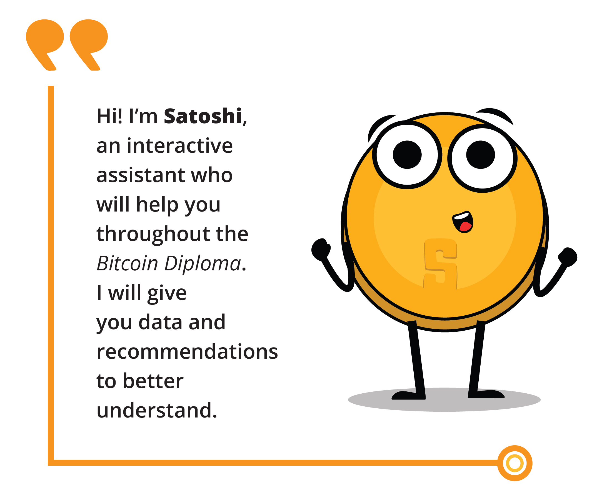

<!-- (Picture) Привет! Я Сатоши, интерактивный помощник, который поможет вам на протяжении всего курса получения биткойн-диплома. Я дам вам данные и рекомендации для лучшего понимания.] -->
 

### ***1.1 Class Discussion: What is Money?***

- Please do not eat the piece of candy placed on your desk yet.
- Who would be willing to trade their candy for a US$1 bill?
- Now, keep your hands up if you would still be willing to do the trade your candy for a $1 monopoly bill instead for your piece of candy?
  - Why or why not?

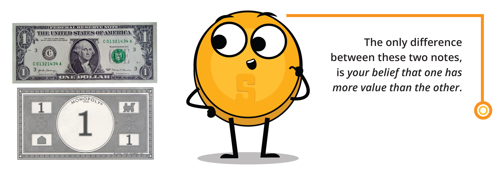

<!-- (Picture) Единственная разница между этими двумя купюрамы заключается в вашей убеждение в том, что одна имеет большую ценность, чем другая. -->

- What makes one bill so desirable and another one as good as trash?
- What gives money it’s “value”?
- Where does money come from and who decides how much of it to print?
- Why not print more money and distribute among everyone equally?
- Is money backed by gold? Or, by any other commodity?
- How many people still use cash anyways?

____________________________________________________________________________________________________

### ***1.2 The Limited World: Navigating Scarcity in a Growing Economy***

Imagine you are stranded in a desert and you only have one bottle of water left. You are thirsty and desperate for a drink, but you also know that you will need the water to survive until you can find more. This is a classic example of scarcity - you only have a limited amount of a resource (water) and you must make a choice about how to use it.

In this situation, you might decide to ration it and take small sips over a longer period of time, in order to make it last as long as possible. Alternatively, you might decide to drink as much as you can in one go, hoping that the burst of hydration will give you the energy you need to find more water. Regardless of which choice you make, you are faced with a difficult decision.

- 💡 **Scarcity** forces us to weigh the pros and cons of how we use our resources and make trade-offs.

In this case, the choice is between quenching your _immediate_ thirst and conserving the water for _later_.

This concept of _scarcity_ applies to all kinds of resources, not just water. Whether it’s money, time, or even love and attention, we are constantly faced with choices about how to allocate our limited resources.

 

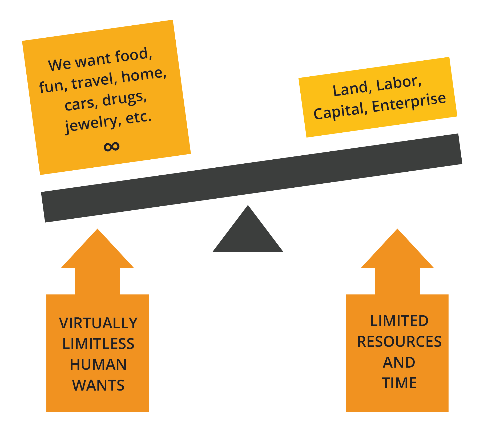

 

- There are two types of scarcity: **man-made scarcity** and **natural**.
  - **Man-made scarcity**, also known as _centralized scarcity_, includes things like limited edition designer bags, rare sports cards, and numbered art pieces. These can be easily replicated or counterfeited.
  - **Natural scarcity**, also known as _decentralized scarcity_, includes things like salt, shells, and precious metals like gold. These are harder to replicate or counterfeit.
- The main difference between the two is control. Centralized scarcity is controlled by a single entity, like a company or government, while decentralized scarcity is not controlled by anyone.

**Scarcity** affects our choices and understanding it can improve our decision-making. We often have to choose between immediate gains and long-term benefits, and these trade-offs shape our path to achieving our goals.

____________________________________________________________________________________________________

- In the context of the desert example, this means that you might be more inclined to drink all of the water right away, even if it means that you won’t have any left for later. This is because the thirst you feel right now is more pressing than the potential thirst you might feel in the future.
- On the other hand, if you choose to ration the water and drink it slowly over time, you are demonstrating a lower time preference. This means that you are willing to wait to satisfy your thirst in order to have a greater chance of survival in the long run.

- 💡 **Time preference** refers to the idea that people generally prefer to have something NOW rather than later.

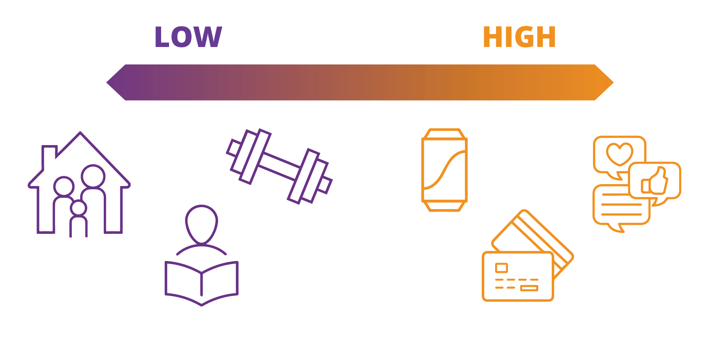

- For example, let’s say you have the option to receive $100 today or $110 in a year. If you have a high time preference, you might choose to receive the $100 today, because you value the immediate satisfaction of having the money now more than the potential benefit of waiting for an extra $10 in a year. On the other hand, if you have a low time preference, you might be willing to wait for the larger reward in the future, because you are less concerned with immediate gratification and more focused on long-term planning.

The concept of ***opportunity cost*** is closely related to the idea of **scarcity** and **time preference**.

- 💡 **Opportunity cost** refers to the value of the next best alternative that you give up when you make a decision. **Every decision involves trade-offs.**

- In the desert example, the opportunity cost of drinking all of the water right away is the survival benefits you would have gained from rationing the water and using it over a longer period of time.

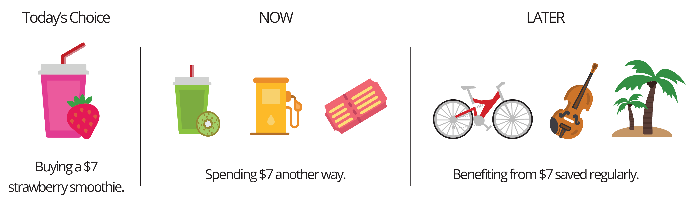

____________________________________________________________________________________________________

- Let’s say that you decide to ration the water and take small sips over a longer period of time. As a result, you have the energy and hydration you need to search for more water.
- However, while you are searching, you come across a cactus that has a small amount of water inside. It’s not a lot, but it’s enough to quench your thirst for the moment. If you had decided to drink all of your water at once, you might not have had the energy to search for more water and come accoss the cactus. In this case, the **opportunity cost** of drinking all of your water at once would have been the chance to find the cactus and get more hydration.

This example illustrates how opportunity cost involves not just the immediate **trade-off** between two options, but also the potential future opportunities that may be gained or lost as a result of our choices. Our willingness to give up a larger reward in the future in exchange for a smaller reward now is influenced by our **time preference** or how much we value immediate gratification versus long-term planning.    
    
Corporations, Governments, and Societies also have to make choices.
    
| CORPORATIONS  | GOVERNMENTS / SOCIETIES |
| ------------- | ------------- |
| Firing 200 Employees vs. Freezing Wages | Building a New Highway vs. Increasing Teacher Salaries |
| Asking for a Loan vs. Bringing in more Shareholdes | Funding Cance Treatment Research vs. Clean Energy |

 
 

### ***1.3 Definition of Money***

### _1.3.1 We Can Use It, but Can We Define It?_

Have you ever stopped to think about what money really is? Ever even wonder what makes money, well, money? Most of us know how to use it, but not many of us understand where it comes from or how it works.

Money is essentially a way to exchange goods and services. It represents the value of these items in a form that can be easily traded.

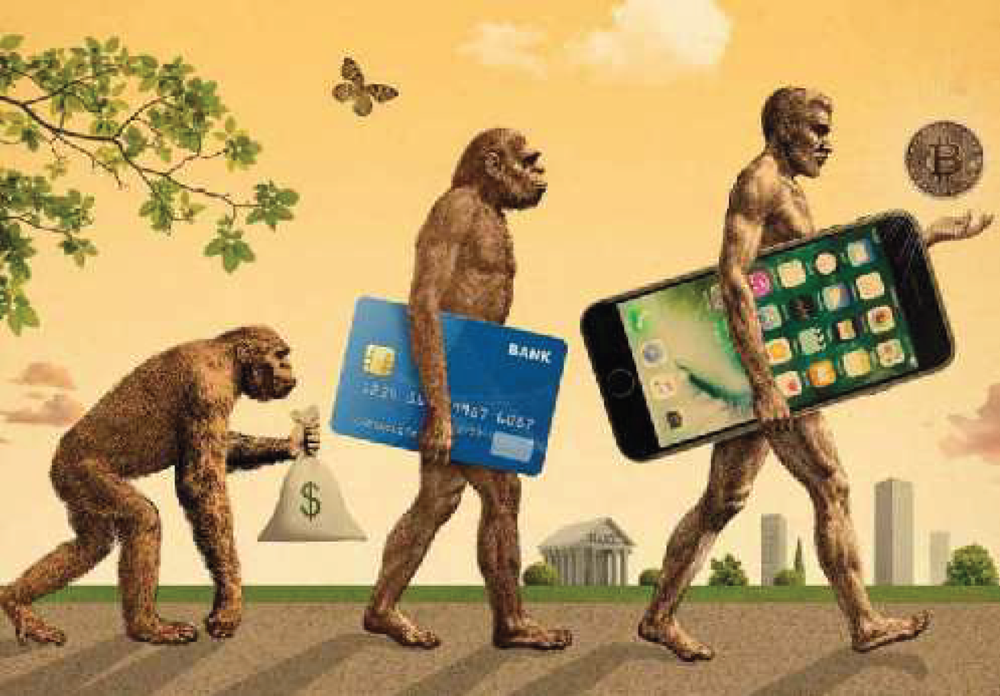

____________________________________________________________________________________________________

This can take many different forms, such as paper notes, metal coins and electronic payments. Governments or other authorities typically issue and control money.

But money is so much more than just a physical or digital medium of exchange. It’s like a universal language that allows us to trade with people all around the world, even if we don’t speak the same language or have the same culture. For example, you can be on the other side of the world and still “speak” money by placing a product on the counter and exchanging it for the local currency or using a credit card. Money is like a social contract that allows us to make exchanges without having to rely on bartering or finding someone who specifically wants what we have to offer. If a group of people started accepting chocolate as payment for most goods and services, chocolate would become money. (Although, since it would melt in some parts of the world, we might consider it bad money).

As French economist Jean Baptiste Say pointed out, “Money performs but a momentary function in an exchange; and when the **transaction** is finally closed, it will always be found that one kind of commodity has been exchanged for another.”

In other words, money itself doesn’t have the power to satisfy human wants. It’s just a tool that allows us to trade one commodity for another.

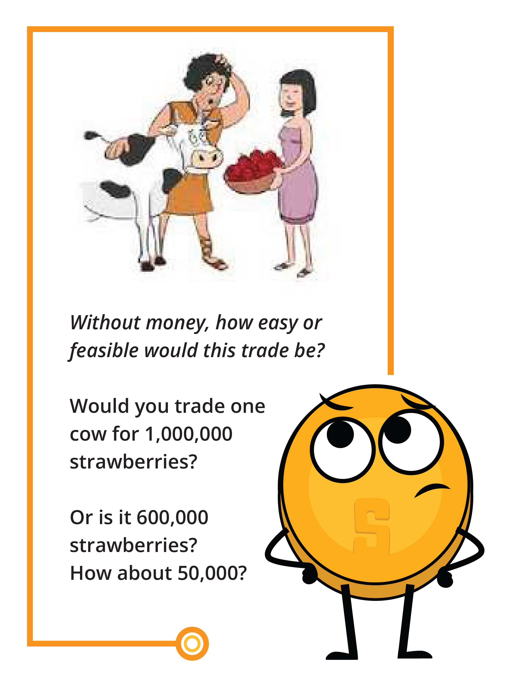

- 💡 **Transaction** is an exchange or transfer of goods and services. It is a way of exchanging value between two or more parties.

There are many different types of transactions, ranging from simple exchanges (such as buying a sandwich at a deli) to more complex financial transactions (such as buying a house or investing in stocks or bonds). Transactions can be conducted in person, over the phone, online, or through other means, and they can involve a wide range of parties, including individuals, businesses, and financial institutions.

- 💡 Money **IS** the value **BY** which goods are exchanged. Money **IS NOT** the value **FOR** which goods are exchanged.

____________________________________________________________________________________________________

<a rel="Video" href="https://www.youtube.com/watch?v=InwVM6s7WoY">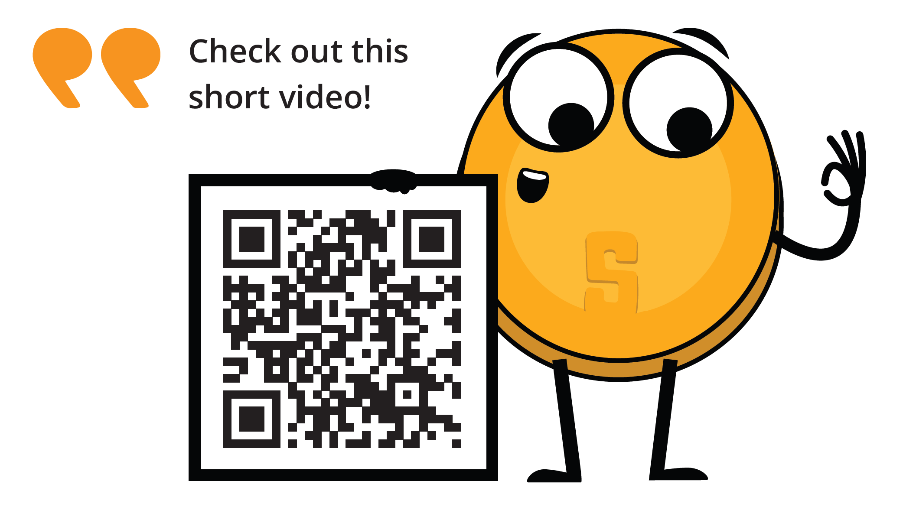</a>

In summary, **money**:
- **Facilitates trade** because **everyone accepts it as final payment**.
- Allows us to **Measure** the **value** and to **make comparisons** between different goods and services.
- Lowers our time preference, as it allows us to **save** and **spend it in the future**.

 

### _1.3.2 Functions of Money_

When it comes to buying and selling goods and services, money is the key player. It has several important jobs, like:

- **Making exchanges easier:** With money, you don’t have to find someone who wants exactly what you have to trade. Instead, you can use money to buy and sell anything you want. This makes trading and commerce much more convenient and efficient.

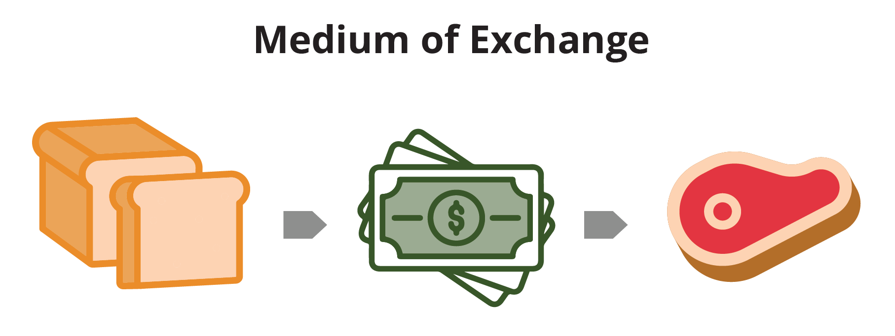

- **Being a unit of account:** Money provides a universal standard of value that allows people to express and compare the price of different goods and services. This allows for a more efficient and transparent market, where people can make informed decisions about what to buy and sell.
  - Think of it like this: if you wanted to buy a new car, you could compare prices from different dealerships and make an informed decision about which one to buy based on the price in dollars. Without a unit of account, you’d have to try to compare the value of one car to another using something else, like the number of cows it was worth or the length of time it took to make the car.

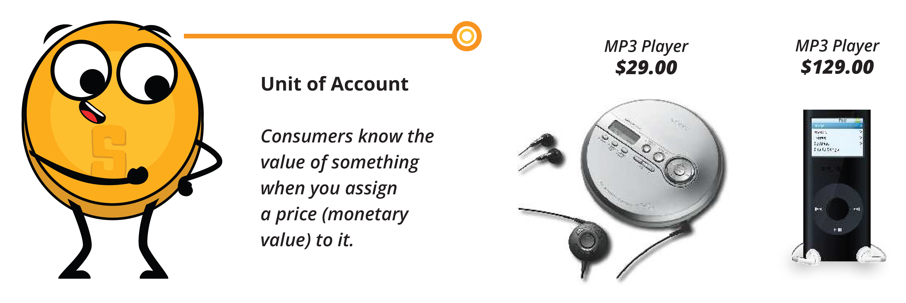

____________________________________________________________________________________________________

- **Being a store of value:** Money should maintain its value over time, making it useful as a way to save and invest the value of human labor. This allows people to use money as a tool to plan for the future and to borrow and lend money to each other.

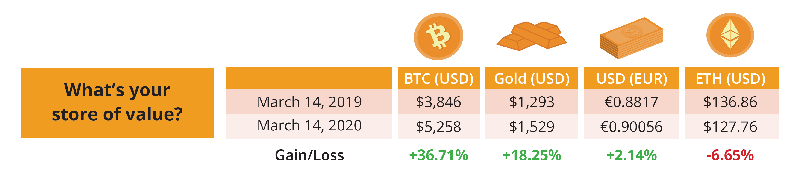

So next time you’re saving up for something special, remember that money is more than just a way to pay for things - it’s a tool to help you plan and invest in your future.

These three functions are what allow economies to become complex and dynamic. Without money, it would be much harder to buy and sell goods and services, and our economy would be much less developed.

 

**$\color[RGB]{104,60,148} Class $**  **$\color[RGB]{104,60,148} Exercise.$** What function of money is this an example of?

1. Roby decided to save a portion of his weekly paychecks to buy a puppy. ______
2. Jim buys two slices of pizza for $8.30 at Ray’s Pizza. ______
3. Marc can’t decide whether to buy concert tickets for $75 or buy a ski pass for $95. ______

 
 

### _1.3.3 Money Characteristics_

Over time, people ultimately have realized that money must possess certain qualities in order to be effective as a medium of exchange. These characteristics include durability, portability, divisibility, fungibility, scarcity, and acceptability.

- ***Durability*** refers to the ability of money to resist physical deterioration and last over time. This ensures that money can circulate in the economy in an acceptable and recognizable state.
  - Gold is a durable material that can withstand wear and tear, making it a good representation of the durability characteristic of money.

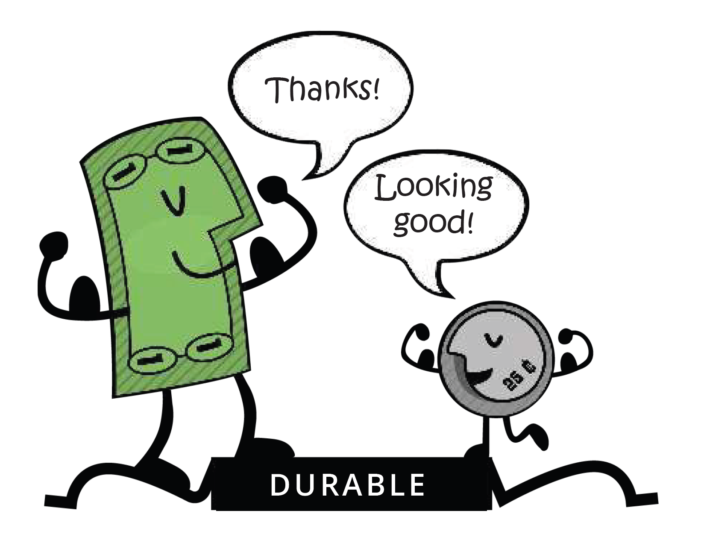

____________________________________________________________________________________________________

- ***Portability*** refers to the ease with which money can be transported and carried around. This allows people to use money to buy and sell goods and services without difficulty.
  - Credit cards are portable, as they can easily be carried in a wallet or purse, making them a good representation of the portability characteristic of money.

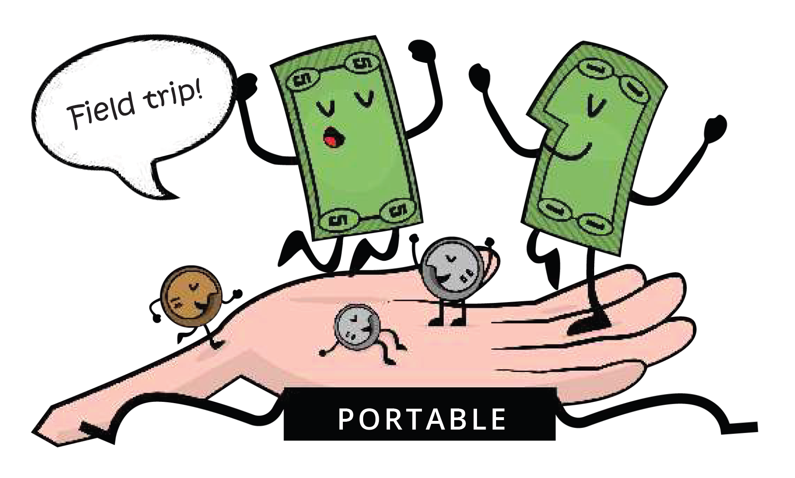

- ***Acceptability*** refers to the widespread acceptance of money as a form of payment, so that people can use it to buy and sell goods and services with confidence.
  - The US dollar is widely accepted as a form of payment, making it a good representation of the acceptability characteristic of money.

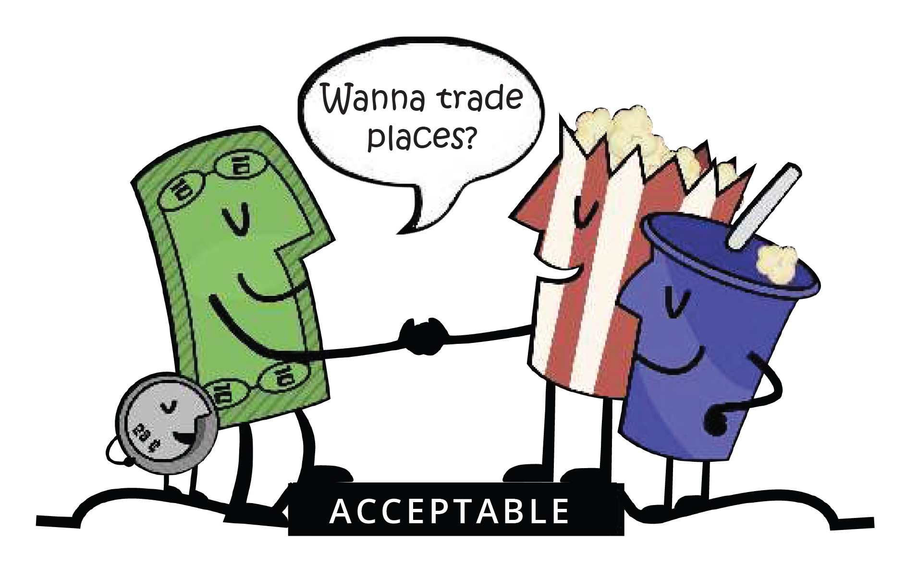

- ***Scarcity*** refers to the limited supply of money, which helps to maintain its value and prevent us from having to spend more money to buy the same amount of goods.
  - Collectible stamps, especially rare and valuable ones, can be a good form of money because they are scarce and can appreciate in value over time. Stamp collectors often use their stamps as a way to invest their wealth and to diversify their portfolio.

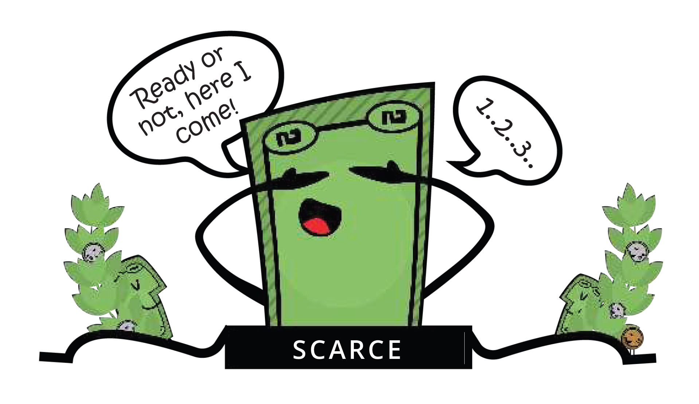

- ***Fungibility*** refers to the interchangeability of money, so that one unit of money is equivalent to another unit of the same value.
  - Money should be **uniform**.
  - Copper coins are uniform in size and weight, making them a good representation of the uniformity characteristic of money.

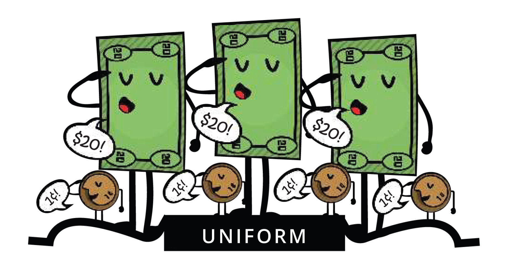

____________________________________________________________________________________________________

- ***Divisibility*** refers to the ability of money to be divided into smaller units, so that people can use it to make purchases of varying amounts.
  - Paper bills can be easily divided into smaller denominations, making them a good representation of the divisibility characteristic of money.

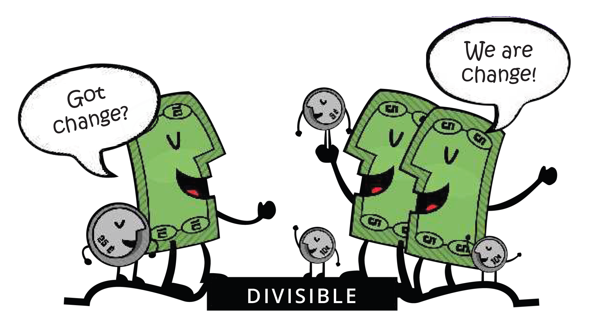

Overall, these characteristics make money a useful and effective tool for facilitating trade and commerce, and they are essential for the development and stability of economies.

 

**$\color[RGB]{104,60,148} Class $**  **$\color[RGB]{104,60,148} Exercise.$** Different assets have different properties and perform the functions of money to varying degrees. Society ultimately determines which asset is used as money based on factors such as its stability, scarcity, divisibility, transferability, and acceptance as a medium of exchange.

To determine how well different items meet the specific characteristics of money, you can score each item on a scale from 1 to 5 for each characteristic. By tallying up the scores for each item, you can determine which one is best suited to be a form of money.

<em> [ 0 = Terrible; 3 = Okay; 5 = Excellent] </em>

<strong>* Please do not fill in the column for Bitcoin; we will return to it later in the course.</strong>

 

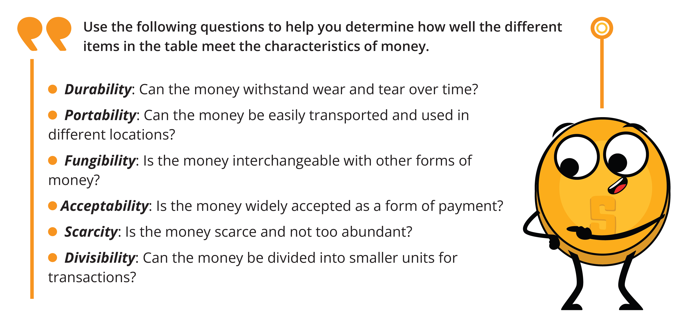

____________________________________________________________________________________________________

| Characteristic of Good Money  | 🐄  Cows | 🚬  Cigarettes | 💎  Diamonds | 💶  Euros | ₿  Bitcoin |
| ------------- | ------------- | ------------- | ------------- | ------------- | ------------- |
| DURABLE |     |     |     |     |     |
| PORTABLE |     |     |     |     |     |
| UNIFORM |     |     |     |     |     |
| ACCEPTABLE |     |     |     |     |     |
| SCARCE |     |     |     |     |     |
| DIVISIBLE |     |     |     |     |     |
| TOTAL |     |     |     |     |     |

 
 

### _1.3.4 Types of Money_

When it comes to money, there are two main categories: **physical and digital**.

For **physical money**, we have three options:

- **Fiat money** is what we use every day, like paper bills and coins. It’s issued by the government and accepted as a medium of exchange, even though it’s not backed by any physical commodity.
- **Representative money** represents a claim on a physical commodity. Like fiat money, it can also be a paper bill (i.e. a gold or silver certificate), but unlike fiat, it is backed by a physical commodity society considers valuable. This means, for example, that a gold certificate worth one dollar can be traded for one dollar’s worth of gold at a bank, which used to be the case in many countries.
- **Commodity money** is a physical object that has intrinsic value and is widely accepted as a medium of exchange. Gold and silver fit into this category.

____________________________________________________________________________________________________

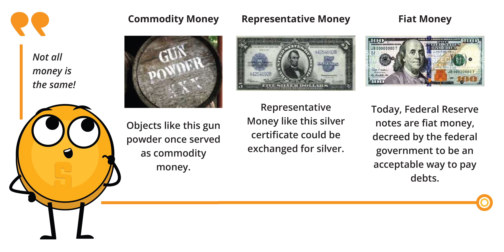

- 💡 **Commodities** (or commodity money) are often considered to be <strong>"fungible"</strong> and have a consistent quality. For example, one barrel of oil is generally considered to be the same as any other barrel of oil, regardless of where it comes from or who produced it.

- 💡 **Payment rails** are like digital highways that help electronic currencies move from one place to another online. They make it easier, faster, and safer to pay for things online, whether you’re using a cryptocurrency like **$\color[RGB]{104,60,148} Bitcoin$** or a traditional payment method, like a credit card.

- 💡 **Central Bank Digital Currencies (CBDCs):** These are digital versions of a country’s fiat currency, which are issued and backed by the central bank, and therefore intermediated by the government. This means government is the middleman in the exchange.

**Electronic currencies** are a type of money that can be used for online transactions. They are like digital versions of regular money, like dollars or euros, and can be used to buy and sell things online via **payment rails**.

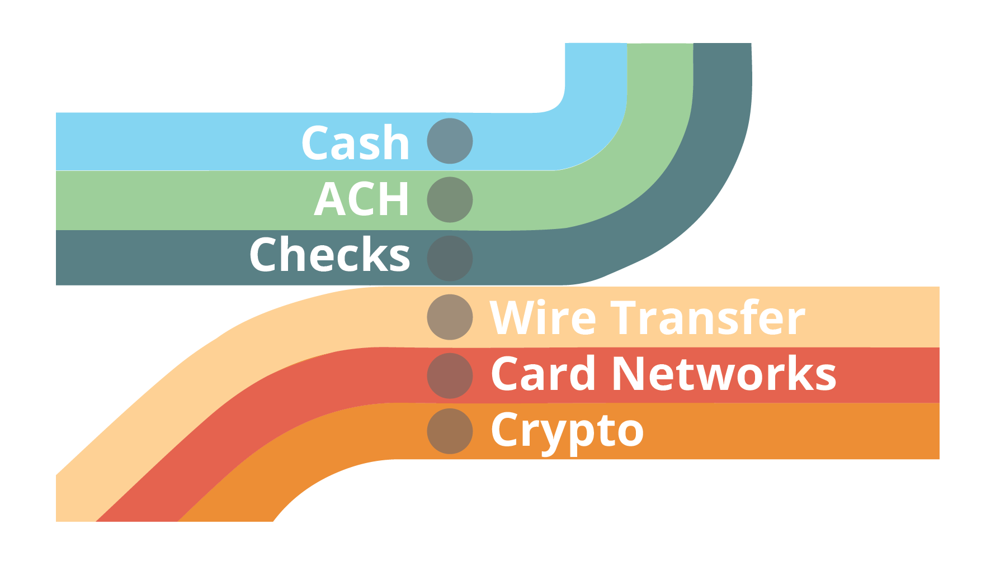

____________________________________________________________________________________________________

**Digital payment rails** in the **traditional financial system** consist of the technology and systems that enable electronic payments to be made and processed, such as bank servers, databases, and secure networks. However, there is always a middleman, such as a bank or financial institution, that charges a fee and has the authority to accept, cancel, revert, or delay transactions.

 

The main types of digital payment rails in the intermediated financial system include:

- ***Card Networks:*** These are networks that facilitate the transfer of funds between financial institutions and merchants when a customer makes a purchase using a debit or credit card. Examples include Visa, Mastercard, and American Express.
- ***Digital Wallets:*** A digital wallet is an online account that allows users to store and manage their electronic currencies (ie digital assets, such as digital fiat, cryptocurrency, or loyalty points). Users can make payments using their e-wallet by transferring funds from their account to the recipient’s account.
- ***Cryptocurrencies:*** Digital currencies that use digital payment rails, or digital highways, to move from one place to another online. They can be thought of as cars that can travel directly from one point to another without stopping at intermediaries, like toll booths on a highway. This means that cryptocurrencies can be transferred and exchanged directly, without the need for a middleman like a bank.

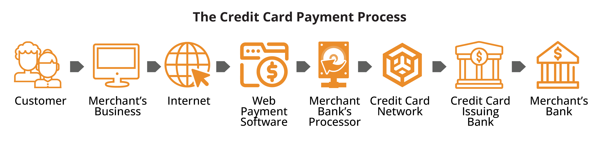

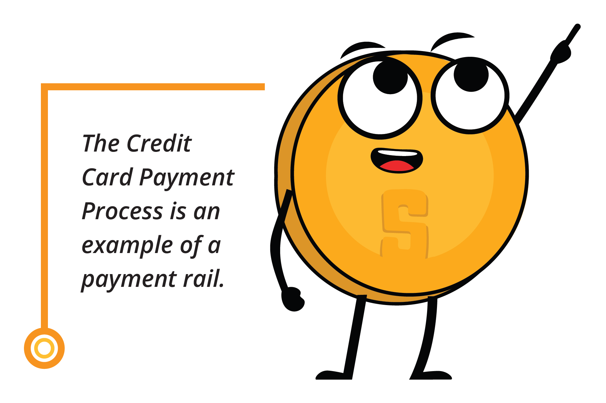

- 💡 **Stablecoins** are cryptocurrencies that are designed to maintain a stable value relative to an asset, like the US dollar. Some are backed by physical assets and all are used as a way to store value or to make transactions without the volatility that can be associated with other cryptocurrencies.

____________________________________________________________________________________________________

A currency operating without intermediaries is more efficient and beneficial for society. It prevents a few individuals from controlling the money supply, and concentrating their power.

However, finding a technology that facilitates secure transactions without relying on trust between parties has been a challenge throughout history. To achieve this, a currency must be created that operates like the internet, where control is distributed among everyone and no one at the same time. This requires the agreement of all parties, including those who hold power, to relinquish control for the greater good.

_But what would such a currency look like?_    
    
    

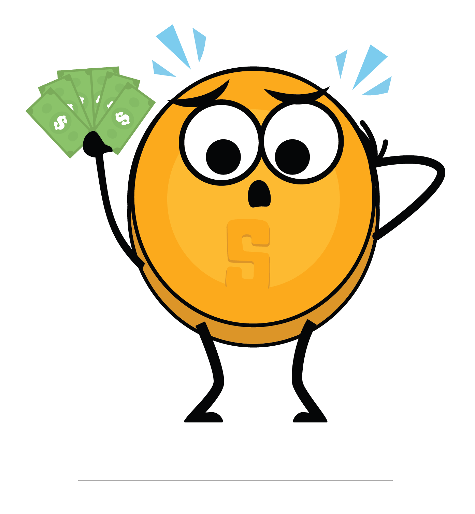

