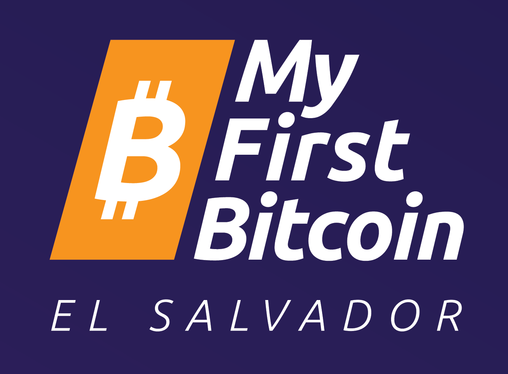
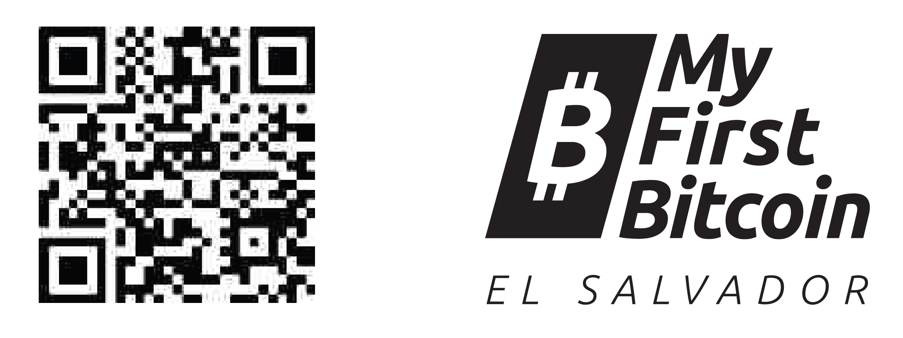

 
 

**_My First Bitcoin_** has created this work and made it    
freely available under **Creative Commons**.    

This work is licensed under     
**Creative Commons**     
**Attribution-ShareAlike**    
**4.0 International (CC BY-SA 4.0)**    
 
 
 

__________________________________________________________________________________________________________    
    
# Bitcoin Diploma    
    
### _Financial Education for the Bitcoin Era_    

 
 

### ***Student Workbook***    
English Version | March 2023        

 
 

***DONATE NOW:***    

 
bc1qc0h5ddd4ln4z05u55l87cp4umg8eg0jjkhcgvf        
      
__________________________________________________________________________________________________________              
           
### Acknowledgments    
    

The Bitcoin Diploma has been a wild success and one that has grown faster than anyone expected. We’d like to give credit to all the wonderful people who got us here.    

Dalia Platt is the curriculum development lead and the driving force behind our content from the start. She is a rockstar. She has had great help for this edition from some amazing contributors, including Madelyn Hereford, Greg Foss, Ronny Avendano, Alejandro Galán, Evelyn Lemus, Gerardo Linares, Marc Platt, Jim Platt, Napoleón Osorio, Victor Yasbek, Robert Malka, and Arel Edelkamp. Gloriana Solano, Raul Guirola, Giacomo Zucco, Gerson Martinez, Vriti Saraf and others supported earlier editions. Gerardo Apostolo and Enrique Jubis, with ACTIVA, also contributed their incredible work.     

The Bitcoin Diploma story began in February 2022 at a meeting at La Pacheco, a public school in San Marcos, El Salvador. Among those present were the school’s innovative director, Asael Rodriguez, bitcoin education advocate and congressman, Rodrigo Ayala, and the community builder for Ibex Mercado, Carlos Toriello, who invited other Bitcoiners, myself included, to come tour the school and discuss education.    

The first Bitcoin Diploma students began in April, with early support from Ibex as well as hundreds of individual donors. By June, the first group of 38 students graduated at La Pacheco and we began to expand. With tremendous support from new donors and sponsors, including Bitfinex, local mayors, and Bitcoin Beach, enrollment has continued to more than double in size every ten weeks, a trend which will allow us to reach thousands of students all over the country this year. In February 2023, delivery of the curriculum began in Guatemala with plans to bring it to many more nations before the year’s end, including Colombia, Honduras, South Africa, Ecuador, and the United States. Donations from those programs will subsidize even more students in El Salvador.    

The Bitcoin Diploma workbook has been made open source. It is freely available and has been translated, printed out, and independently taught to communities around the world, from South Korea to Uruguay.    

Mi Primer Bitcoin is a non-profit with a singular mission—to provide quality, independent and impartial, community-based Bitcoin education to everyone in El Salvador as fast as possible. As the first nation to adopt Bitcoin, El Salvador will be an example to the world; we get to decide what sort of example that will be. Our vison is to teach a nation and change the world. I know that sounds crazy, but I think we are well on our way and the Bitcoin Diploma is a big part of that.

For a better world,    

**John Dennehy**    
Founder    
**_Mi Primer Bitcoin_**    
March 2023
