## _Chapter #2_

# ***From Barter to Bitcoin and CBDCs: A Travel Through Time***

- [**2.0** Introduction](https://github.com/MyFirstBitcoin/Translation/blob/main/%D0%9C%D0%BE%D0%B9%20%D0%9F%D0%B5%D1%80%D0%B2%D1%8B%D0%B9%20%D0%91%D0%B8%D1%82%D0%BA%D0%BE%D0%B8%D0%BD%20-%20Russian/2023%20-%20March/WebView/14.Chapter-2.md#20-%D0%B2%D0%B2%D0%B5%D0%B4%D0%B5%D0%BD%D0%B8%D0%B5)
  - [**2.0.1** Class Exercise: Barter Game](https://github.com/MyFirstBitcoin/Translation/blob/main/%D0%9C%D0%BE%D0%B9%20%D0%9F%D0%B5%D1%80%D0%B2%D1%8B%D0%B9%20%D0%91%D0%B8%D1%82%D0%BA%D0%BE%D0%B8%D0%BD%20-%20Russian/2023%20-%20March/WebView/14.Chapter-2.md#201-%D0%BA%D0%BB%D0%B0%D1%81%D1%81%D0%BD%D0%BE%D0%B5-%D1%83%D0%BF%D1%80%D0%B0%D0%B6%D0%BD%D0%B5%D0%BD%D0%B8%D0%B5-%D0%B1%D0%B0%D1%80%D1%82%D0%B5%D1%80%D0%BD%D0%B0%D1%8F-%D0%B8%D0%B3%D1%80%D0%B0)         
- [**2.1** Early Forms of Money](https://github.com/MyFirstBitcoin/Translation/blob/main/%D0%9C%D0%BE%D0%B9%20%D0%9F%D0%B5%D1%80%D0%B2%D1%8B%D0%B9%20%D0%91%D0%B8%D1%82%D0%BA%D0%BE%D0%B8%D0%BD%20-%20Russian/2023%20-%20March/WebView/14.Chapter-2.md#21-%D1%80%D0%B0%D0%BD%D0%BD%D0%B8%D0%B5-%D1%84%D0%BE%D1%80%D0%BC%D1%8B-%D0%B4%D0%B5%D0%BD%D0%B5%D0%B3)       
- [**2.2** Commodities to I.O.U’s](https://github.com/MyFirstBitcoin/Translation/blob/main/%D0%9C%D0%BE%D0%B9%20%D0%9F%D0%B5%D1%80%D0%B2%D1%8B%D0%B9%20%D0%91%D0%B8%D1%82%D0%BA%D0%BE%D0%B8%D0%BD%20-%20Russian/2023%20-%20March/WebView/14.Chapter-2.md#22-%D0%BE%D1%82-%D1%82%D0%BE%D0%B2%D0%B0%D1%80%D0%BE%D0%B2-%D0%BA-%D0%B4%D0%BE%D0%BB%D0%B3%D0%BE%D0%B2%D1%8B%D0%BC-%D1%80%D0%B0%D1%81%D0%BF%D0%B8%D1%81%D0%BA%D0%B0%D0%BC)       
- [**2.3** Transition from Sound Money to Unsound Money](https://github.com/MyFirstBitcoin/Translation/blob/main/%D0%9C%D0%BE%D0%B9%20%D0%9F%D0%B5%D1%80%D0%B2%D1%8B%D0%B9%20%D0%91%D0%B8%D1%82%D0%BA%D0%BE%D0%B8%D0%BD%20-%20Russian/2023%20-%20March/WebView/14.Chapter-2.md#23-%D0%BF%D0%B5%D1%80%D0%B5%D1%85%D0%BE%D0%B4-%D0%BE%D1%82-%D0%BD%D0%B0%D0%B4%D1%91%D0%B6%D0%BD%D1%8B%D1%85-%D0%B4%D0%B5%D0%BD%D0%B5%D0%B3-%D0%BA-%D0%BD%D0%B5%D0%BD%D0%B0%D0%B4%D1%91%D0%B6%D0%BD%D1%8B%D0%BC)      
- [**2.4** Where are We Today?](https://github.com/MyFirstBitcoin/Translation/blob/main/%D0%9C%D0%BE%D0%B9%20%D0%9F%D0%B5%D1%80%D0%B2%D1%8B%D0%B9%20%D0%91%D0%B8%D1%82%D0%BA%D0%BE%D0%B8%D0%BD%20-%20Russian/2023%20-%20March/WebView/14.Chapter-2.md#24-%D0%B3%D0%B4%D0%B5-%D0%BC%D1%8B-%D0%BD%D0%B0%D1%85%D0%BE%D0%B4%D0%B8%D0%BC%D1%81%D1%8F-%D1%81%D0%B5%D0%B3%D0%BE%D0%B4%D0%BD%D1%8F)          
- [**2.5** The Price of Control: A Look at Surveillance, Censorship, and Regulation](https://github.com/MyFirstBitcoin/Translation/blob/main/%D0%9C%D0%BE%D0%B9%20%D0%9F%D0%B5%D1%80%D0%B2%D1%8B%D0%B9%20%D0%91%D0%B8%D1%82%D0%BA%D0%BE%D0%B8%D0%BD%20-%20Russian/2023%20-%20March/WebView/14.Chapter-2.md#25-%D1%86%D0%B5%D0%BD%D0%B0-%D0%BA%D0%BE%D0%BD%D1%82%D1%80%D0%BE%D0%BB%D1%8F-%D0%B2%D0%B7%D0%B3%D0%BB%D1%8F%D0%B4-%D0%BD%D0%B0-%D1%81%D0%BB%D0%B5%D0%B6%D0%BA%D1%83-%D1%86%D0%B5%D0%BD%D0%B7%D1%83%D1%80%D1%83-%D0%B8-%D1%80%D0%B5%D0%B3%D1%83%D0%BB%D0%B8%D1%80%D0%BE%D0%B2%D0%B0%D0%BD%D0%B8%D0%B5)        
  - [**2.5.1** The Rise of a Cashless Society](https://github.com/MyFirstBitcoin/Translation/blob/main/%D0%9C%D0%BE%D0%B9%20%D0%9F%D0%B5%D1%80%D0%B2%D1%8B%D0%B9%20%D0%91%D0%B8%D1%82%D0%BA%D0%BE%D0%B8%D0%BD%20-%20Russian/2023%20-%20March/WebView/14.Chapter-2.md#251-%D0%B2%D0%BE%D0%B7%D0%BD%D0%B8%D0%BA%D0%BD%D0%BE%D0%B2%D0%B5%D0%BD%D0%B8%D0%B5-%D0%B1%D0%B5%D0%B7%D0%BD%D0%B0%D0%BB%D0%B8%D1%87%D0%BD%D0%BE%D0%B3%D0%BE-%D0%BE%D0%B1%D1%89%D0%B5%D1%81%D1%82%D0%B2%D0%B0)         
  - [**2.5.2** Surveillance](https://github.com/MyFirstBitcoin/Translation/blob/main/%D0%9C%D0%BE%D0%B9%20%D0%9F%D0%B5%D1%80%D0%B2%D1%8B%D0%B9%20%D0%91%D0%B8%D1%82%D0%BA%D0%BE%D0%B8%D0%BD%20-%20Russian/2023%20-%20March/WebView/14.Chapter-2.md#252-%D0%BD%D0%B0%D0%B1%D0%BB%D1%8E%D0%B4%D0%B5%D0%BD%D0%B8%D0%B5)         
  - [**2.5.3** Financial Regulations and Censorship](https://github.com/MyFirstBitcoin/Translation/blob/main/%D0%9C%D0%BE%D0%B9%20%D0%9F%D0%B5%D1%80%D0%B2%D1%8B%D0%B9%20%D0%91%D0%B8%D1%82%D0%BA%D0%BE%D0%B8%D0%BD%20-%20Russian/2023%20-%20March/WebView/14.Chapter-2.md#253-%D1%84%D0%B8%D0%BD%D0%B0%D0%BD%D1%81%D0%BE%D0%B2%D0%BE%D0%B5-%D1%80%D0%B5%D0%B3%D1%83%D0%BB%D0%B8%D1%80%D0%BE%D0%B2%D0%B0%D0%BD%D0%B8%D0%B5-%D0%B8-%D1%86%D0%B5%D0%BD%D0%B7%D1%83%D1%80%D0%B0)         

___________________________________________________________________________________________________

### ***2.0 Introduction***    

The concept of money has evolved over time. In its early forms, money was used to facilitate trade and exchange of goods and services.

- In ancient civilizations, people relied on bartering, a system of direct exchange of goods and services without the use of a medium of exchange.
- Later, metal coins and paper currency were introduced as more convenient forms of money, paving the way for the sophisticated financial systems we have today.

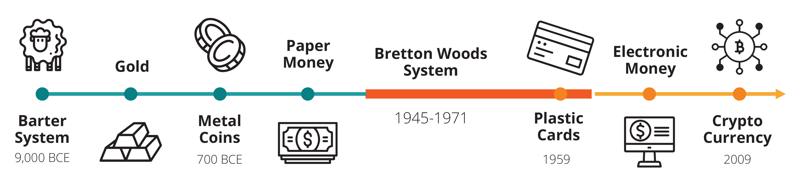

In this chapter, we will embark on a journey through time, experiencing the evolution of money firsthand. We’ll trace its origins and observe how it has changed and adapted through history.

### _2.0.1 Class Exercise: Barter Game_   

- **Round #1 - Barter**

It is the year 6000 B.C.E. Needless to say, money as we know it has not been invented. You are in Mesopotamia and directly exchange goods and services with one another through **bartering**.

- 💡 As a side-note, many businesses still accept non-monetary payments for their services, and governments treat these bartered transactions the same as currency transactions for taxreporting purposes.

 

- Cut your sheet of paper at the dashed line. Your goal is to trade away your “have” as many times as you need to finally get your original “want”. You cannot change your original “want”. You will have 5 minutes to accomplish the goal of this exercise.

- When your new “have” matches your original “want”, return to your seat. After the time is up, if you have not found a trading partner, return to your seat anyway.

___________________________________________________________________________________________________

- ✋ Raise your hand if you were able to get what you wanted after one trade. Two? Three?

**$\color[RGB]{104,60,148} Questions.$** Answer the following questions briefly but substantially.

1. Why were some of you able to get someone to trade with and others were not?
_______________________________________________________________________________________________
_______________________________________________________________________________________________
_______________________________________________________________________________________________
_______________________________________________________________________________________________
2. What are the benefits of barter?
_______________________________________________________________________________________________
_______________________________________________________________________________________________
_______________________________________________________________________________________________
_______________________________________________________________________________________________
3. Based on your experience with this exercise, what are the drawbacks to using barter?
_______________________________________________________________________________________________
_______________________________________________________________________________________________
_______________________________________________________________________________________________
_______________________________________________________________________________________________

 

- **Round #2 - Commodity Money**

Fast forward and travel to the western coast of Africa sometime around the 14th century BCE. Bartering has become tedious and inefficient. We have evolved as a civilization and are now using **commodity money**.

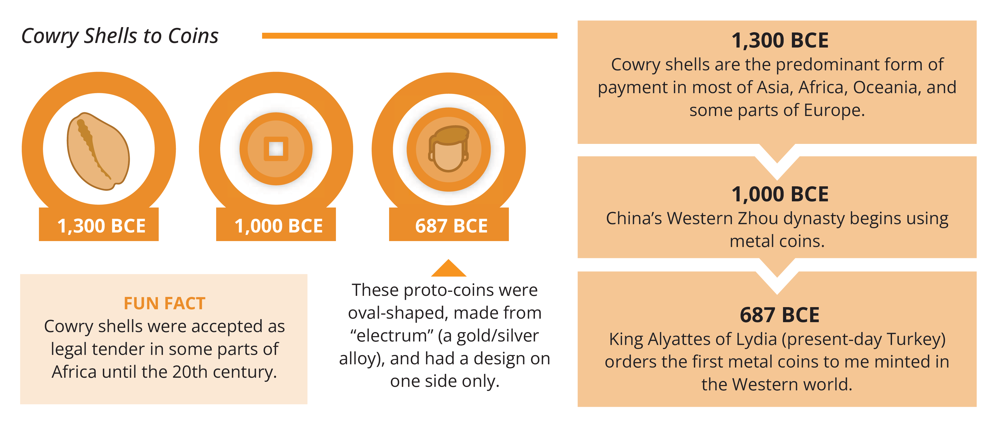

___________________________________________________________________________________________________

Your teacher has given you one macaroni (for simplicity purposes). Let’s assume that by convention, the price of each good is worth one macaroni. Your goal again is to obtain what you “want”. But now, our species has smartened up a bit and found a way to solve certain problems.
- Why do we consider macaroni commodity money?
- How do we get the things we want now?
- Was the macaroni round easier?
- Why do you think money has replaced commodities?
- In what ways is using commodity money more efficient than bartering?
- What are the drawbacks to using macaroni as money?

 

What do you think happened when Spain started to bring back boatloads of macaroni into your community (gold and silver from the Americas back to Spain)?
____________________________________________________________________________________________________________
____________________________________________________________________________________________________________
____________________________________________________________________________________________________________
____________________________________________________________________________________________________________
____________________________________________________________________________________________________________
____________________________________________________________________________________________________________

 
 

### ***2.1 Early Forms of Money***    

<a rel="Video" href="https://www.youtube.com/watch?v=-nZkP2b-4vo">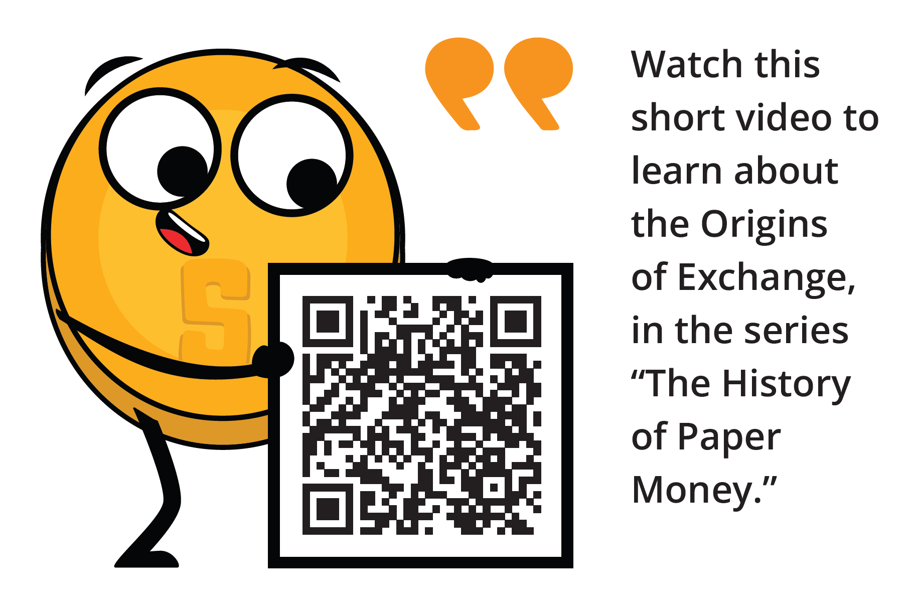

In **barter economies**, people trade with each other based on the relative value of the goods and services that they have to offer. **Barter economies** are _inefficient_ and can be difficult to manage, especially in complex societies.
 
 

- 💡 A situation, known as the **double coincidence of wants**, is necessary in any bartering system since people must always find someone who has what they want but also wants what they have to offer.

 

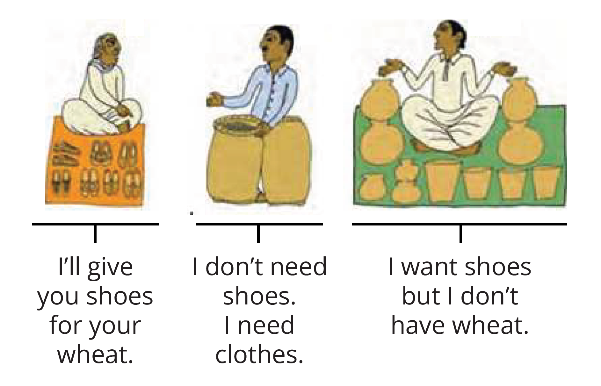

________________________________________________________________________________________________________________________________

Let’s suppose:
- Joseph wants to trade his banana for Yael’s coconut.
- But Yael only wants to trade her coconut for Tammy’s mango.
- And Tammy only wants to trade her mango for Joseph’s banana.
- They are stuck in a never-ending cycle of fruit trading without a double coincidence of wants.
- Joseph suggests they just trade their fruits for a nice cold soda, but they realize they are on a remote island and there is no soda.
- They decide to just sit on the beach and enjoy their fruits in silence.

Using a **common unit of account**, such as a “soda”, makes trade and commerce much more efficient. In ancient times people began by using beads, shells, and other items that had value in their society as **mediums of exchange**.

 
 

### ***2.2 From Commodities to I.O.U’s***

As you and your community become more involved in trade and commerce, you realize the limitations of using bartering and other forms of non-monetary exchange. You decide to adopt the use of **metal coins as a form of money**.

 

<strong>Why Money was Invented</strong>

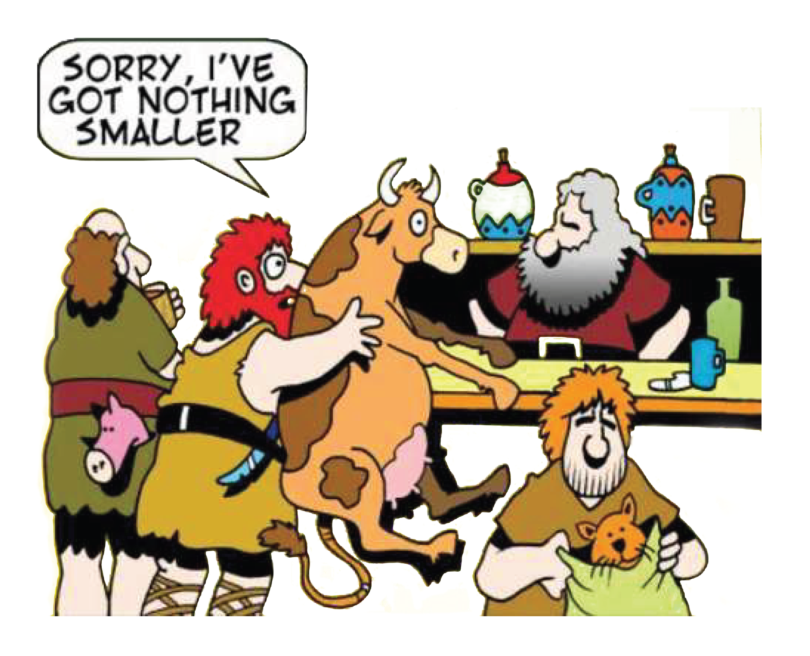</a>

 

<a rel="Video" href="https://www.youtube.com/watch?v=rPHTmGjoe2k">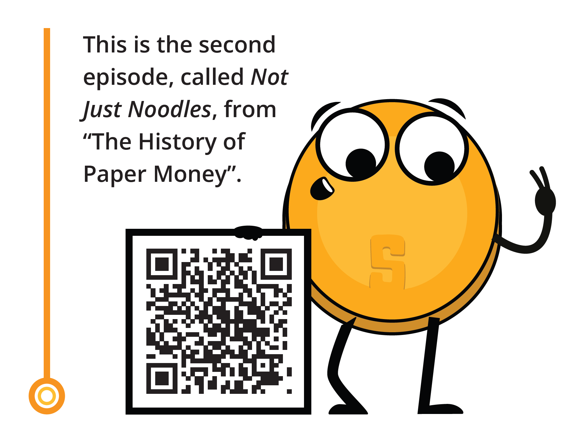</a>

- 💡 These metal coins are made of valuable materials like gold and silver, and they serve as a medium of exchange and unit of account to facilitate trade and commerce: **commodity money**.

___________________________________________________________________________________________________

However, as you _begin to use metal coins more frequently_, you encounter some drawbacks. They can be heavy and inconvenient to carry in large transactions, and you notice that some people are taking advantage of the system by melting down the coins and creating new ones by mixing them with cheaper metals, which causes prices to rise and undermines trust in the system.

In an effort to address these issues, you and your community start to use paper receipts as a form of money. These paper receipts, which have their origins in ancient China, are a convenient and easily exchangeable form of currency. They are backed by gold and other valuable metals, and can be converted into these metals during the seventeenth through the nineteenth century. This allows you to have a more portable and easily transferable form of money, while still maintaining the value and security of precious metals.

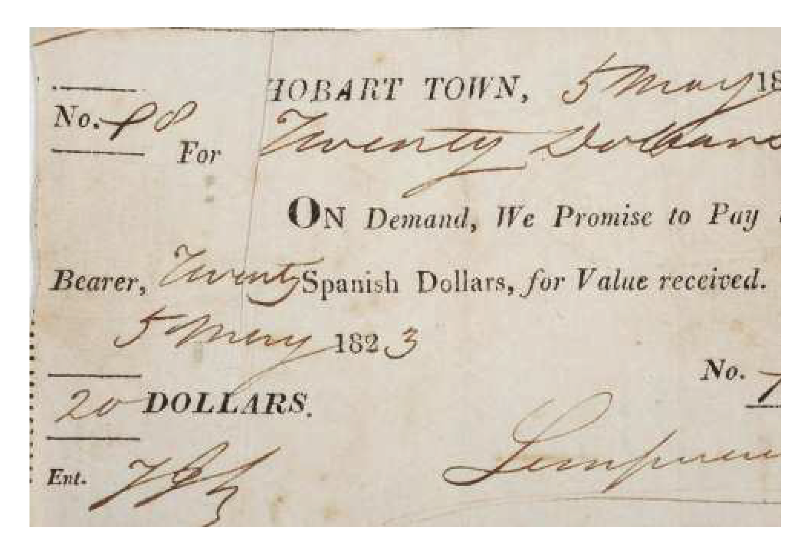</a>

 

### ***2.3 Transition from Sound Money to Unsound Money***

<a rel="Video" href="https://www.youtube.com/watch?v=lzH1p3t2oRE">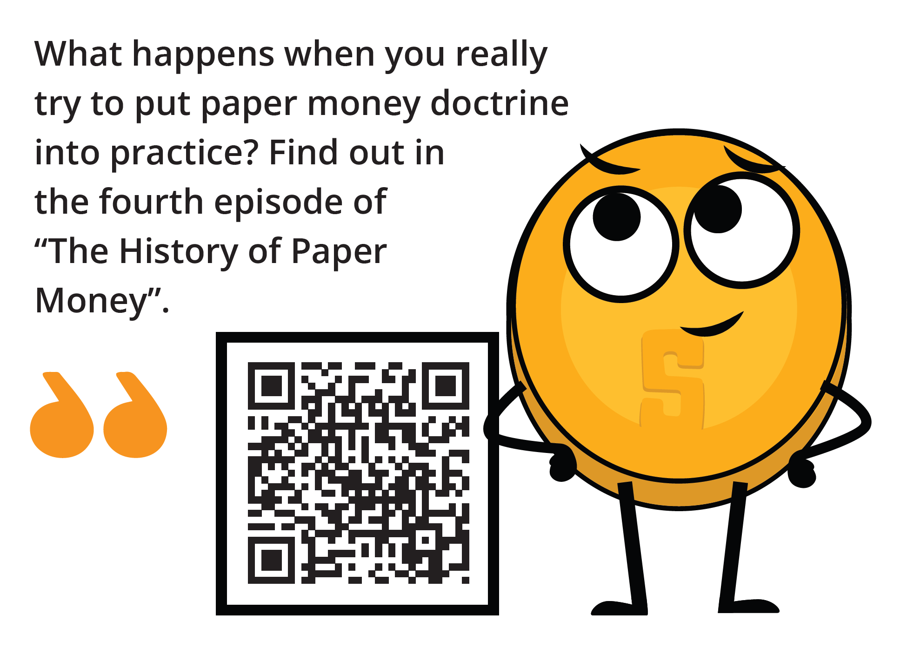</a>

Fast forward to the 17th century in Sweden. Now you are completely dependent on banks to store your valuable assets. However, you start to notice something fishy going on with these bankers. It seems they are issuing more paper receipts than they have gold in storage, allowing them to create more money than they have assets to back it up. This sneaky practice allows the bankers to profit from the difference between the value of the paper receipts and the value of the gold they are holding for their customers.

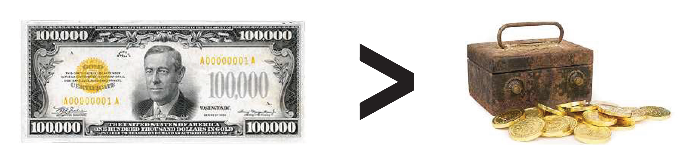</a>

___________________________________________________________________________________________________

You realize that this marks a major shift in the way money works. You are moving from a system of sound money (i.e. money backed by precious metals) to a system of unsound money (i.e. fiat currency not backed by a physical commodity). This transition didn’t happen overnight, but rather was a gradual process influenced by several factors. The Industrial Revolution, with its mass production and urbanization, played a role, as did the growth of advanced financial systems like banks and stock markets. The emergence of central banks and other monetary authorities contributed to the centralization or the control of money, leading to the issuance of fiat currencies to support economic growth.

- 💡 However, you also begin to see the **downsides of this centralization**, including irresponsible consumption, an increase in debt, and manipulation of citizens through economic incentives.

Until World War I, you were able to convert your paper money into a preset amount of gold. But the two world wars and the 1929 economic crisis put an end to that. In 1944, the Bretton Woods agreement is signed, establishing the U.S. dollar as the world’s reserve currency and fixing the value of the U.S. dollar to the price of gold at a rate of $35 per ounce. Other countries’ currencies are pegged to the dollar, which helps to stabilize international financial markets.

 

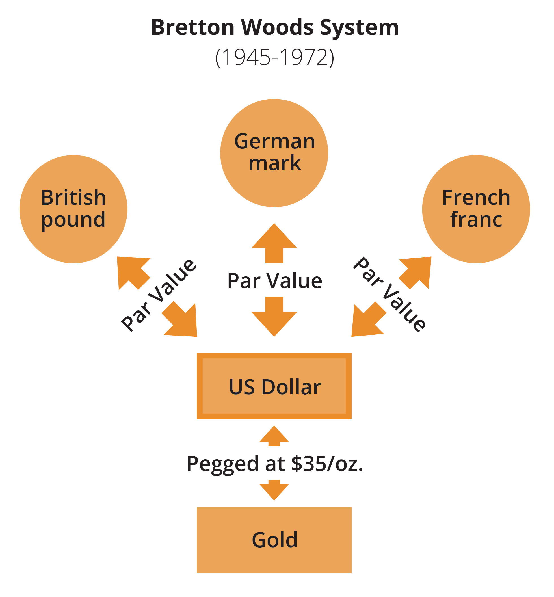</a>

Unfortunately, the system begins to break down in the late 1960s, leading to the Nixon Shock in 1971, when the U.S. government suspends the convertibility of the dollar into gold. This marks the end of the gold standard and the beginning of a world driven by the creation and accumulation of debt.

As you go about your daily life, you begin to notice that the value of money is no longer as stable as it used to be. Just like a flexible ruler makes it difficult to accurately measure the length of a table, living in a fiat world where the value of money is subject to the unpredictability of those in power can also make it difficult to accurately measure the value of goods and services. You feel confusion and unease adjusting to a world where the value of money is no longer tied to a physical commodity like gold.

___________________________________________________________________________________________________

You see the impacts of this shift on the global economy and start to question the stability and reliability of fiat currencies. You realize that in this modern world, the dollar is no longer fixed and consistent as it was when it was pegged to gold, but instead becomes subject to fluctuation. This makes it more difficult to use the dollar as a unit of account, as its value is affected by various factors including inflation (rising prices), interest rates, the strength of the country’s economy, political events, market speculation, and demand in international trade. It can be a confusing and unpredictable time, as you try to navigate the constantly shifting value of the dollar and its impact on your daily life.

Despite efforts to improve quality of life through modern monetary systems, increased efficiency, greater access to information, and enhanced communication, the majority of people’s standards of living begin to decline due to:

- Abuse of centralization.
- Rising prices.
- Stagnated real wages.
- Weakening currencies.
- The need to spend more money for fewer things.

This has challenges for those with lower economic resources, who may have limited access to education, credit, resources, social networks, and political representation, leading to potential disadvantages in their ability to succeed.

As a result, the rich seem to keep getting richer and the poor seem to keep getting poorer.

 
 

> _"I don’t believe we shall ever have good money again until we take the thing out of the hands of government… all we can do, is by some sly, roundabout way, introduce something that they can’t stop."_

***Friedrich Hayek***,    
Nobel Prize Winner of Economics

 

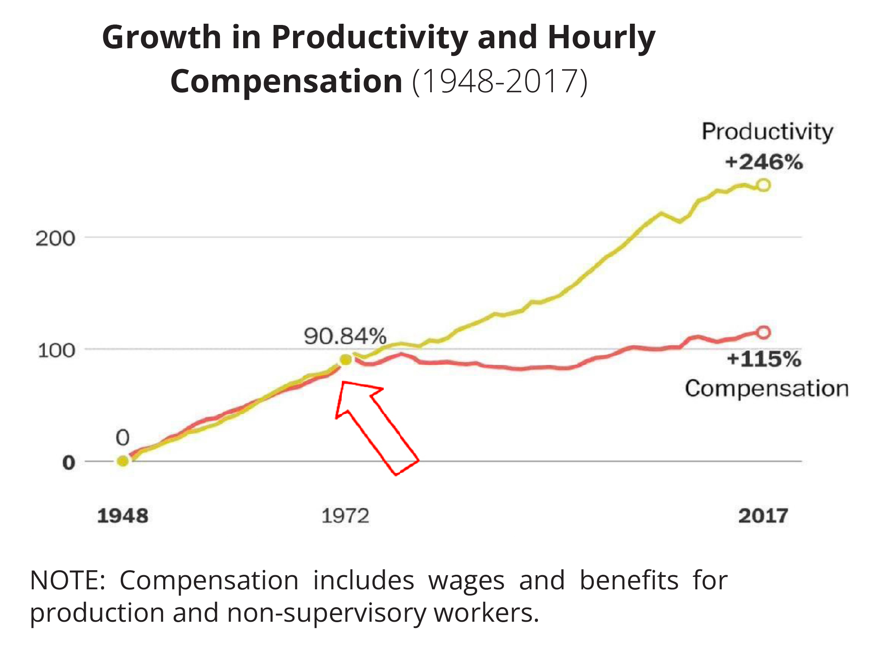</a>

 

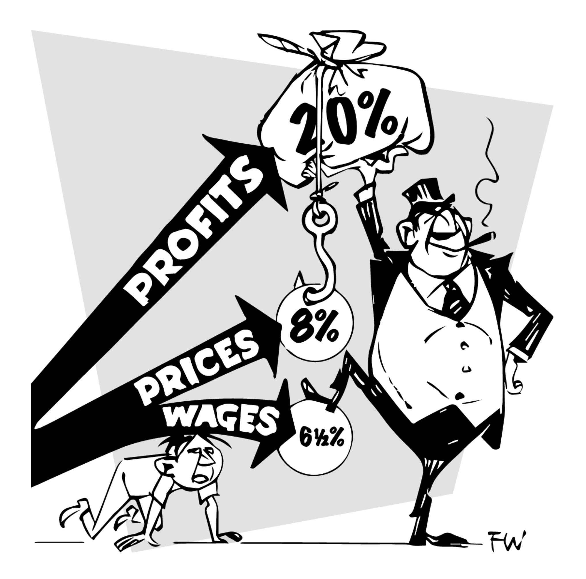</a>

___________________________________________________________________________________________________

### ***2.4 Where Are We Today?***

Today, we’ve come a long way from the introduction of the first credit card back in the 1950s. With a simple swipe of plastic, we can buy whatever we want, whenever we want, without any hassle. It’s like opening up a world of endless possibilities, and the excitement of discovering what it holds is palpable...or so we thought. Little did we know that our reliance on credit would have painful aftereffects — like raising the overall cost of goods, and incentivizing a certain economy doomed to fail.

As technology advances, so does the way we handle money. The internet becomes a major player in the financial world, with online banking and e-commerce websites making it possible to manage and spend money entirely online.    
     

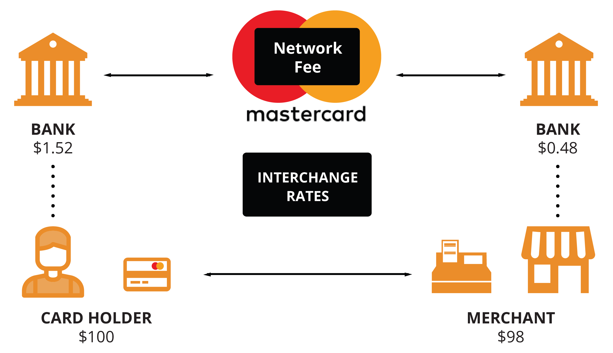</a>
    
    
Then, in 2009, the first decentralized cryptocurrency, **$\color[RGB]{104,60,148} Bitcoin$**, is created. As its popularity grows, it inspires the creation of new technologies and unknown frontiers for the future of money. And so, as we’ll learn, we’ve come full circle from sound money to unsound money and back again, sound money finding new wind in its sails for the first time in almost a hundred years.

### ***2.5 The Price of Control: A Look at Surveillance, Censorship, and Regulation***        

### _2.5.1 The Rise of a Cashless Society_

When the first credit card was introduced in the 1950’s and people rejoiced at the thought of never having to carry around actual cash again. No more fumbling for loose change or awkward checkwriting moments at the checkout counter. All those pesky intermediaries can now take their cut without you even realizing it, just like a toll on a network. Ah, the convenience of modern finance.

___________________________________________________________________________________________________

But with the rise of digital currencies like CBDCs, it’s like we’ve gone from paying a fee for using the network to having to ask permission. Worse, now we expect to be searched, scanned, and scrutinized by the government every time we pass through. Control and surveillance has taken the place of convenience. And just like the fee from the network, these intrusions into our financial lives come with a cost, whether it’s monetary, a violation of privacy, or the loss of autonomy.

As more of our daily transactions move online, the use of cash declines. Governments and financial institutions around the world are promoting the use of electronic payments and cracking down on the use of physical money. This trend has sparked a debate about the future of cash and the potential consequences of a cashless society.

The **war on cash** is a term that refers to the various efforts to reduce the use of physical money, remove high-denomination bills and promote the use of electronic payments.

Proponents of the war on cash argue that it will make transactions faster, more convenient, and more secure. Critics, however, fear that it could lead to a loss of privacy and financial inclusion and increased risks of fraud and cyber-attacks.

 

- 💡 **Question:** How do traditional banking methods put individuals’ financial data at risk?

- 💡 **Answer:** With credit cards, debit cards, wire transfers, and other centrally controlled payment networks, individuals are giving their private financial transaction data to a third party and potentially sacrificing their rights to privacy.

 

In this infographic, we will provide an overview of the war on cash and explore all sides of the debate. We will look at the reasons behind the push for a cashless society, the challenges and concerns that it raises, and the potential impacts on individuals, businesses, and society as a whole.

- 💡 The question is, are we willing to pay the price for the convenience of modern finance, or will we seek out alternative options that prioritize our freedom and privacy?    

<a rel="Video" href="https://www.visualcapitalist.com/global-war-cash/">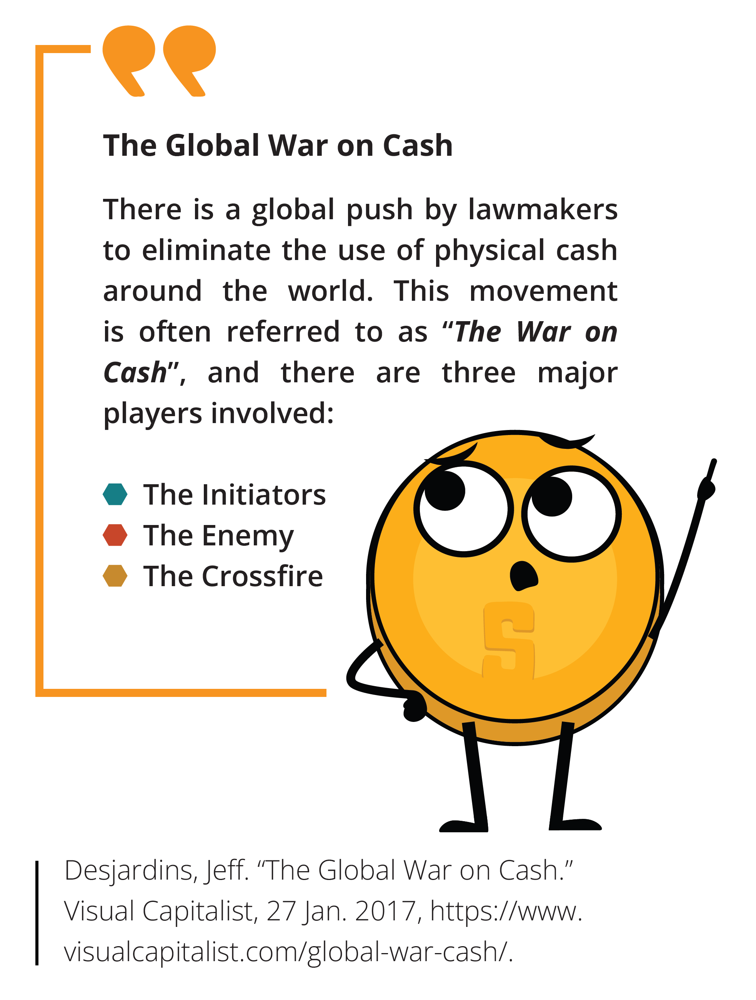</a>

___________________________________________________________________________________________________

 

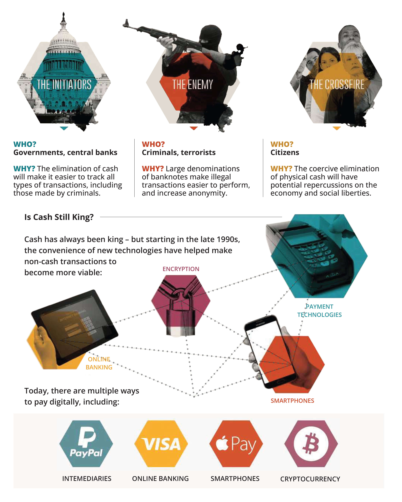</a>

 

___________________________________________________________________________________________________

 

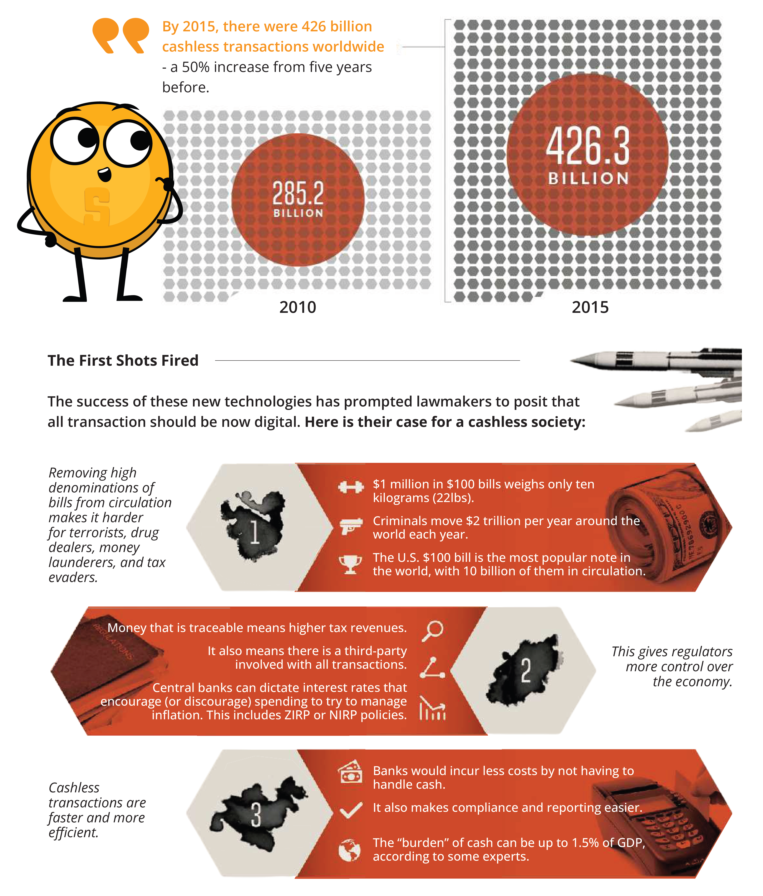</a>

 

___________________________________________________________________________________________________

 

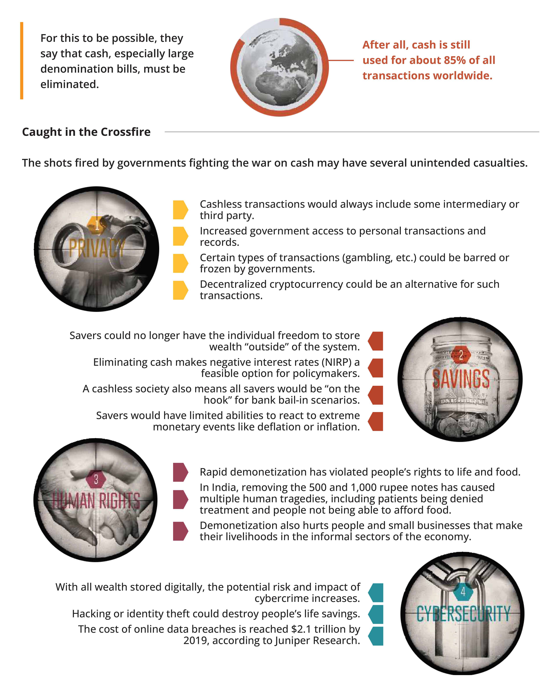</a>

 

___________________________________________________________________________________________________

### _2.5.2 Surveillance_

Surveillance is a tricky business. On the one hand, it helps catch people doing bad things like money laundering. But the more fraud that happens, the more surveillance is needed, which can lead to invasions of privacy through technology. Private companies may also collect and trade your personal information for their own benefit, and the risks of this surveillance can include scams, harassment, extortion, identity theft, and even tracking your card purchases. Plus, with the rise of AI and machine learning, it’s becoming even easier for governments and companies to invade our privacy. Moreover, it’s often the people who are already disadvantaged or underprivileged who are hit the hardest.

 

_The Impact of AI and Technology on Future Privacy and Surveillance_

| Future Effect  | The Rich | The Poor |
| ------------- | ------------- | ----- |
| Access to personal information. | May have access to extensive personal information and can use it to make informed decisions. | May lack this information and may have to rely on outdated or unreliable sources. | 
| Ability to shape the world in their own interests. | May use their access to data to shape the world in their own interests. | May have little influence on what happens. |
| Control over others. | May exert control over the poor through their access to data, leading to a loss of individual freedom. | Little control; are often the controlled. |
|Vulnerability to digital scams, online harassment, extortion, and identity theft. | Likely less vulnerable to these issues with more information and more protection from such scams. | May be more vulnerable to these issues due to a lack of access to resources and information. |

 

### _2.5.3 Financial Regulations and Censorship_

Financial regulations, censorship, and prohibitions can be an emotionally and financially taxing reality for society and its citizens. They come in many forms, such as:

- **Capital Controls or Sanctions:** When spending gets out of control, governments may impose price controls to try and fix the problem. But sometimes these controls make things worse. Governments may also limit how much money citizens can transfer, exchange, or take out of the country. create a Social Credit Score system that can be used to control citizens.

  - How does China’s Social Credit Score system work? In China, financial transactions and other data of all citizens are centrally collected, and used to create a Social Credit Score system that can be used to control citizens.

  - Consider what happened in Greece in 2015 — citizens were only able to withdraw 60 euros per day by government mandate. Similarly, the Chinese are only able to send limited amounts of Renminbi out of the country.

  - There have been several instances in Argentina when the government imposed strict currency controls to try to stabilize the peso. One such instance was in 2011, when the government implemented capital controls to stem the flow of dollars out of the country and to prevent further devaluation of the peso. Another instance was in 2019.

_______________________________________________________________________________________________

- **Restrictive Banking Policies:** Have you ever tried to withdraw cash from an ATM only to find out you’ve reached your daily limit?

Or maybe you’ve tried to transfer money to a friend only to be told there’s a maximum amount you can send. These are just a few examples of restrictive banking policies that can make it tough to access your own money and do what you like with it.

Banks can also charge fees for most transactions and may only be open during certain hours, making it hard to get to your cash or make financial decisions. Carrying around lots of cash increases your risk of getting robbed. On top of all that, banks sometimes offer lower-interest loans to the wealthy, while opening up the poor to loan sharks and higher-interest loans. In so doing, the financial system often profits from the gap between the rich and the poor.

<a rel="Video" href="https://joinhorizons.com/moving-money-in-and-out-china-rules/">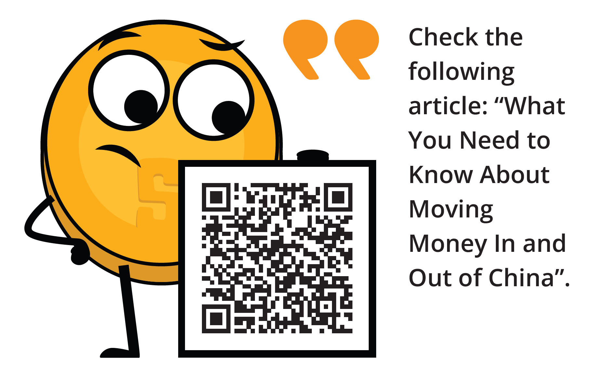</a>

 

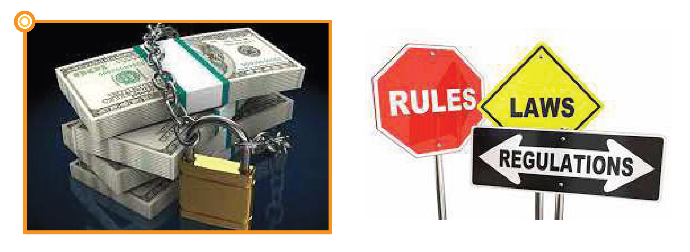</a>

___________________________________________________________________________________________________

- **The Unbanked and Underbanked:** Unfortunately, not everyone has access to traditional banking services, whether it’s because they don’t meet the requirements to open an account or because they live in areas where banking services aren’t available. This can make it difficult for people to access financial services and participate in the global economy.

 

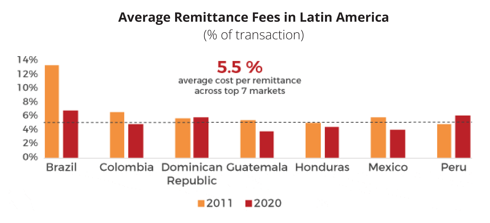</a>

 

   - Imagine a family in a rural village in Brazil that relies on money from a relative working in the US. If the relative sends $100, but the bank charges a $7 fee for the transfer, the family only gets $93. This may not seem like a lot, but for a family living on a tight budget, losing $7 can make a big difference.

- **The Unbanked and Underbanked:** Unfortunately, **not everyone has access to traditional banking services**, whether it’s because they don’t meet the requirements to open an account or because they live in areas where banking services aren’t available. This can make it difficult for people to access financial services and participate in the global economy.

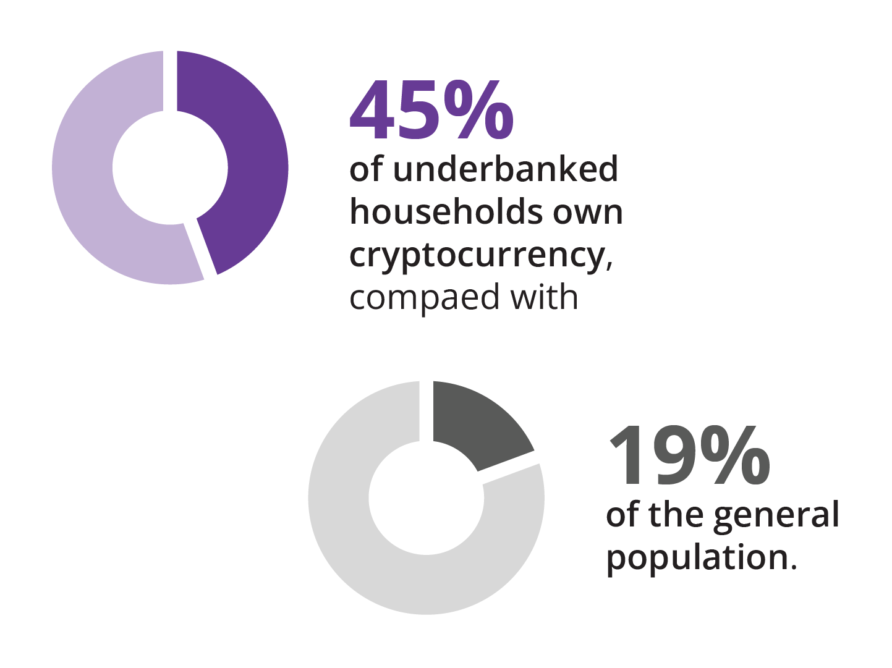</a>

- But wait, there’s more! Governments may also control the exchange rate of their currency, which can make it hard for people to exchange money between countries or lead to **unfavorable exchange rates**. Financial institutions may **block donations** to certain organizations or individuals, or take away your bank account altogether. Social media platforms and financial institutions may remove certain content if they believe it is spreading misinformation or violating their community standards or policies. This is sometimes referred to as **censorship** and can include a wide range of activities, such as blocking or suppressing content, limiting access, or removing information altogether.

___________________________________________________________________________________________________

Surveillance, control, and hidden fees are only the political downsides of the current system we live in. Unfortunately, there are a series of hidden economic costs as well — ones that we often never get to learn about.    
    

</a>

