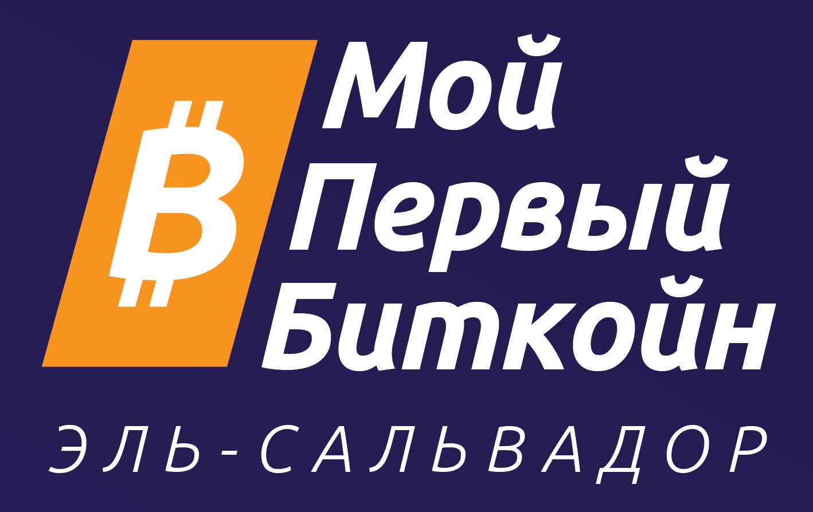
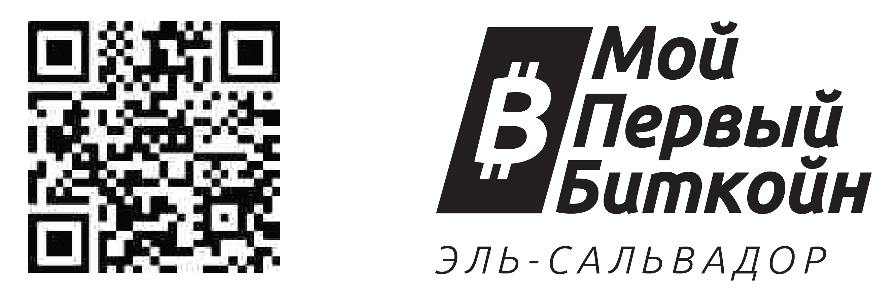

 
 

**_Мой Первый Биткойн_** создал эту работу и предоставил её    
в свободном доступе на условиях **Creative Commons**.    

Эта работа находится под лицензией     
**Creative Commons**     
**Attribution-ShareAlike**    
**4.0 International (CC BY-SA 4.0)**    
 
 
 

__________________________________________________________________________________________________________    
    
# Биткойн-Диплом    
    
### _Финансовое Образование в Эпоху Биткойна_    

 
 

### ***Рабочая Тетрадь Для Учащихся***    
Русская Версия | Декабрь 2023 г.    
На Основе Английской Версии | Март 2023 г.    

 
 

***ПОЖЕРТВОВАЙТЕ СЕЙЧАС:***    

 
bc1qc0h5ddd4ln4z05u55l87cp4umg8eg0jjkhcgvf        
      
__________________________________________________________________________________________________________              
           
### Благодарности    
    
    
Биткойн-диплом имел ошеломительный успех и вырос быстрее, чем кто-либо ожидал. Мы хотели бы отдать должное всем замечательным людям, которые привели нас сюда.    

Далия Платт — руководитель разработки учебных программ и движущая сила нашего контента с самого начала. Она рок-звезда. В подготовке этого издания ей оказали большую помощь замечательные авторы, в том числе Мэделин Херефорд, Грег Фосс, Ронни Авендано, Алехандро Галан, Эвелин Лемус, Херардо Линарес, Марк Платт, Джим Платт, Наполеон Осорио, Виктор Ясбек, Роберт Малка и Арел Эделькамп. А также, Глориана Солано, Рауль Гирола, Джакомо Зукко, Герсон Мартинес, Врити Сараф и другие поддержали более ранние издания. Херардо Апостол и Энрике Хубис из ACTIVA также внесли свой невероятный вклад.    

История Биткойн-диплом началась в феврале 2022 года на встрече в Ла Пачеко, государственной школе в Сан-Маркосе, Сальвадор. Среди присутствующих были директор школы по инновациям Асаэль Родригес, сторонник биткойн-образования и конгрессмен Родриго Айала и создатель сообщества Ibex Mercado Карлос Ториелло, который пригласил других биткойнеров, включая меня, посетить школу и обсудить образование.    

Первые студенты, получившие Биткойн-диплом, начали приниматься в апреле при ранней поддержке со стороны Ibex, а также сотен индивидуальных доноров. К июню первая группа из 38 студентов закончила обучение в Ла Пачеко, и мы начали расширяться. Благодаря огромной поддержке со стороны новых доноров и спонсоров, включая Bitfinex, местных мэров и Bitcoin Beach, набор студентов продолжает увеличиваться более чем вдвое каждые десять недель, и эта тенденция позволит нам в этом году охватить тысячи студентов по всей стране. В феврале 2023 года реализация учебной программы началась в Гватемале, и до конца года планируется распространить её на многие другие страны, включая Колумбию, Гондурас, Южную Африку, Эквадор и США. Пожертвования от этих программ позволят субсидировать еще больше студентов в Сальвадоре.    

Рабочая тетрадь Биткойн-диплом стала открытой. Он находится в свободном доступе, его переводили, распечатывали и независимо преподавали сообществам по всему миру, от Южной Кореи до Уругвая.    

Мой Первый Биткойн — это некоммерческая организация с единственной миссией — как можно быстрее обеспечить качественное, независимое и беспристрастное обучение Биткойна на уровне сообщества для всех в Сальвадоре. Будучи первой страной, принявшей Биткойн, Сальвадор станет примером для всего мира; мы сами решим, какой это будет пример. Наша цель – научить нацию и изменить мир. Я знаю, это звучит безумно, но я думаю, что мы на верном пути, и Биткойн-диплом — большая часть этого.    

Для лучшего мира,    

**Джон Деннехи**    
Основатель    
**_Мой Первый Биткойн_**    
Mарт 2023 г.    
