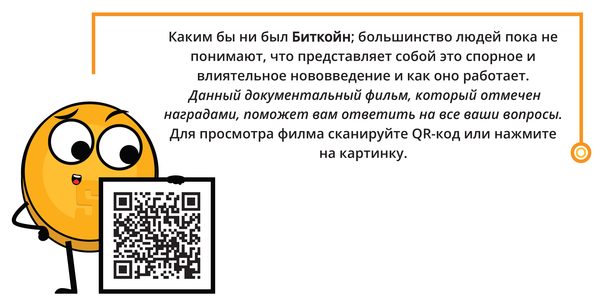

### _Почему Биткойн?_

**$\color[RGB]{104,60,148} **Критическое** $** **$\color[RGB]{104,60,148} **Мышление.** $** Почему **$\color[RGB]{104,60,148} Биткойн $** важен для вас и как, по вашему мнению, он изменит человечество?
_________________________________________________________________________________________________________
_________________________________________________________________________________________________________
_________________________________________________________________________________________________________
_________________________________________________________________________________________________________
_________________________________________________________________________________________________________
_________________________________________________________________________________________________________
_________________________________________________________________________________________________________
_________________________________________________________________________________________________________
_________________________________________________________________________________________________________
_________________________________________________________________________________________________________
_________________________________________________________________________________________________________
_________________________________________________________________________________________________________

   

<h2 align="center">Биткойн-Диплом</h2>   

Десятинедельное трансформационное путешествие через независимое, беспристрастное, качественное и бесплатное образование
    

 

 

_________________________________________________________________________________________________________

Прежде чем изучать **$\color[RGB]{104,60,148} Биткойн$**, важно иметь четкое представление об основах денег, их истории и нынешней финансовой системы. Понимание этих концепций обеспечивает прочную основу для понимания уникальной и революционной природы **$\color[RGB]{104,60,148} Биткойна$**. Узнав об эволюции денег, вы сможете лучше понять потенциал и ограничения нынешней финансовой системы, а также то, как **$\color[RGB]{104,60,148} Биткойн$** стремится их решить. Без этой основы, может быть сложно полностью оценить значение и потенциальное влияние **$\color[RGB]{104,60,148} Биткойна$**. Доверяйте процессу обучения и сохраняйте концентрацию, поскольку награда за более глубокое понимание и признание этой передовой области будет того стоить.

  

Сообщение от Нашего Основателя (Для просмотра сканируйте QR-Код или нажмите на картинку)

