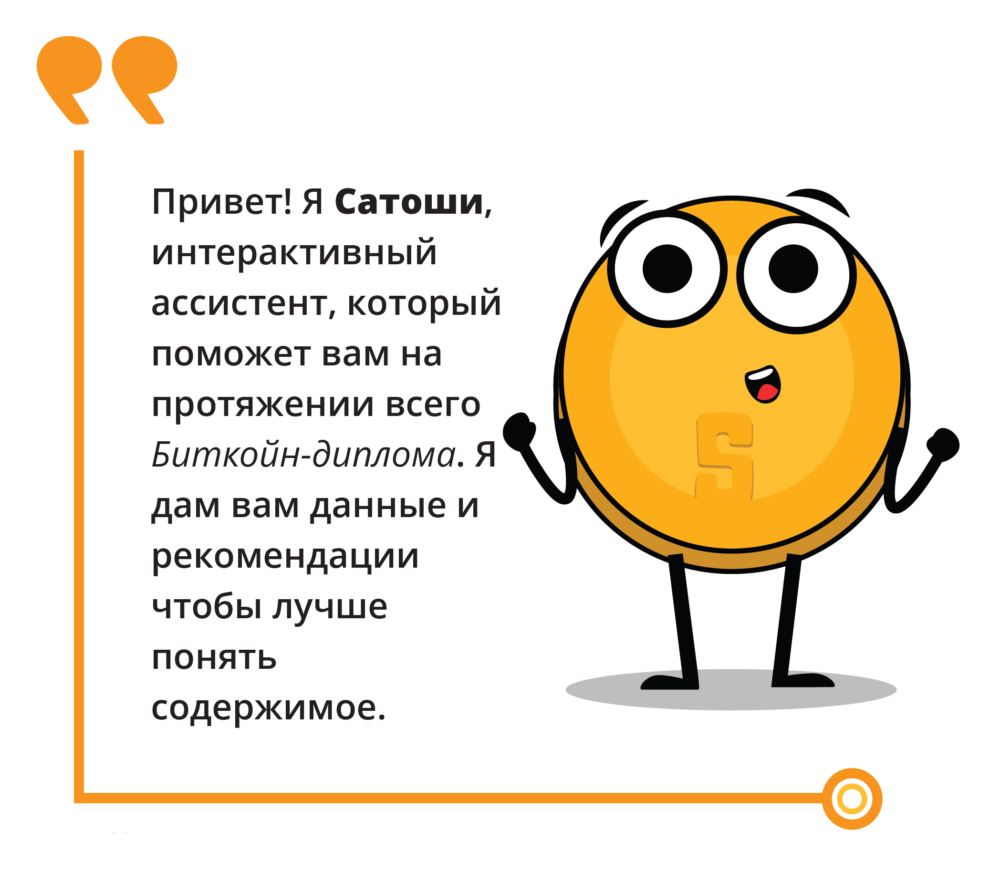
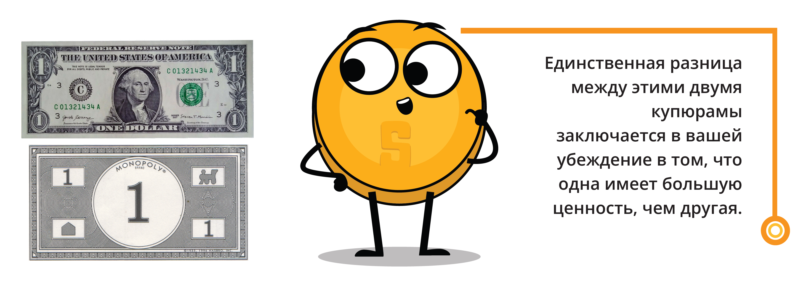
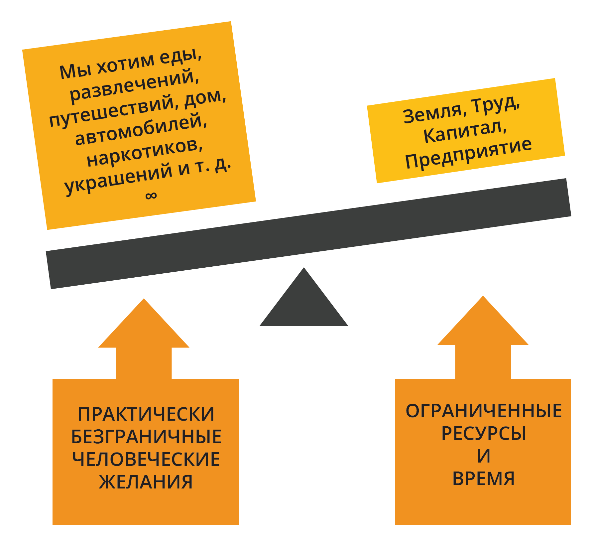
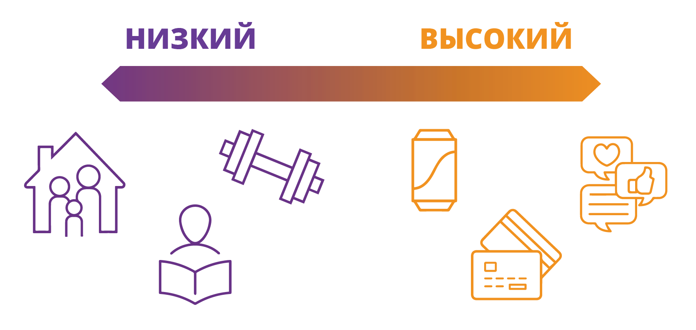
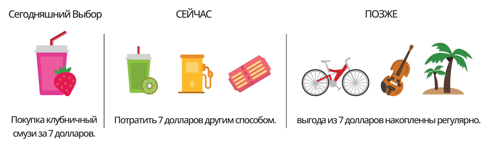
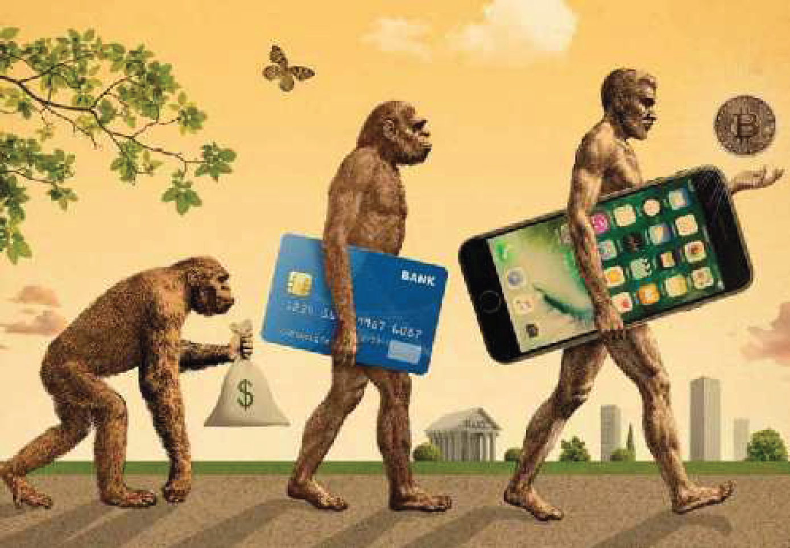
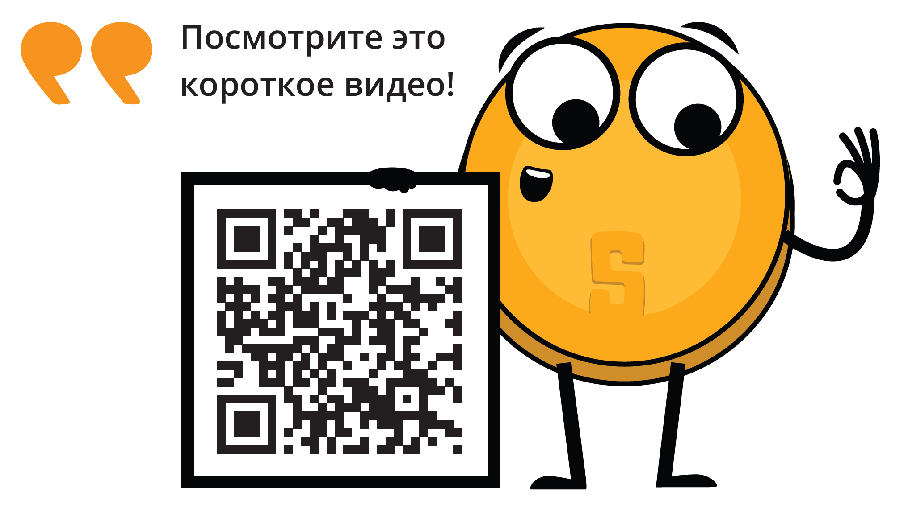
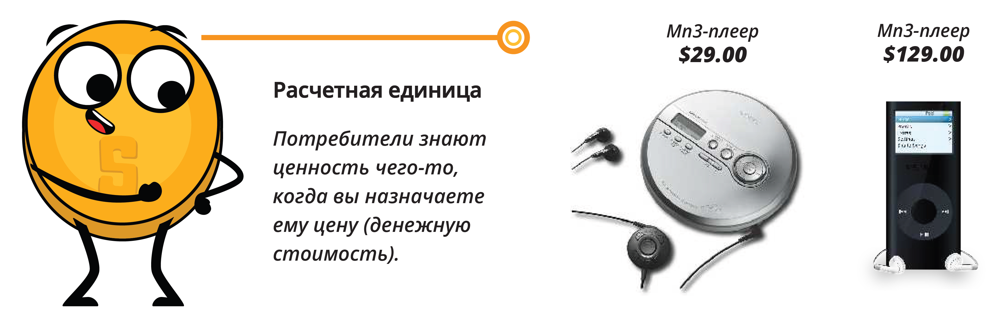
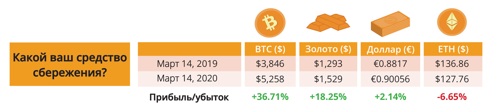
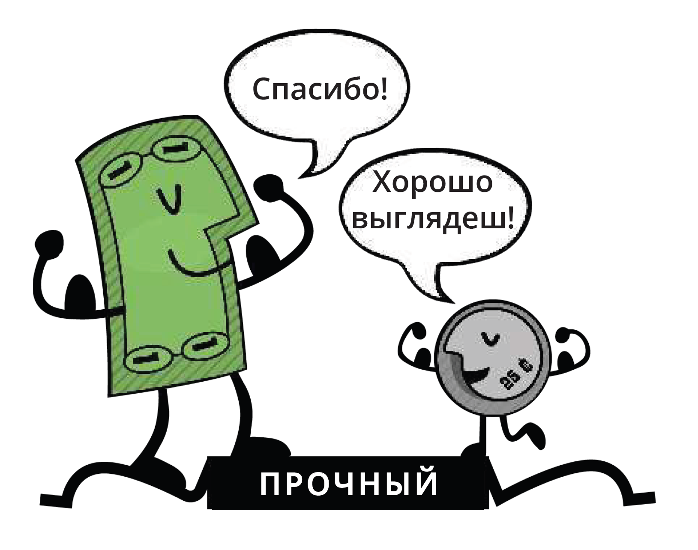

## _Глава №1_

# ***Сила Денег***

- [**1.0** Готовы?](https://github.com/BabaevDaniel/Bitcoin-Diploma-Russian-Version/blob/main/Translated-text/13.Chapter-1.md#10-%D0%B3%D0%BE%D1%82%D0%BE%D0%B2%D1%8B)          
- [**1.1** Обсуждение в Классе: Что Такое Деньги?](https://github.com/BabaevDaniel/Bitcoin-Diploma-Russian-Version/blob/main/Translated-text/13.Chapter-1.md#11-%D0%BE%D0%B1%D1%81%D1%83%D0%B6%D0%B4%D0%B5%D0%BD%D0%B8%D0%B5-%D0%B2-%D0%BA%D0%BB%D0%B0%D1%81%D1%81%D0%B5-%D1%87%D1%82%D0%BE-%D1%82%D0%B0%D0%BA%D0%BE%D0%B5-%D0%B4%D0%B5%D0%BD%D1%8C%D0%B3%D0%B8)          
- [**1.2** Ограниченный Мир: Преодоление Дефицита в Условиях Растущей Экономики](https://github.com/BabaevDaniel/Bitcoin-Diploma-Russian-Version/blob/main/Translated-text/13.Chapter-1.md#12-%D0%BE%D0%B3%D1%80%D0%B0%D0%BD%D0%B8%D1%87%D0%B5%D0%BD%D0%BD%D1%8B%D0%B9-%D0%BC%D0%B8%D1%80-%D0%BF%D1%80%D0%B5%D0%BE%D0%B4%D0%BE%D0%BB%D0%B5%D0%BD%D0%B8%D0%B5-%D0%B4%D0%B5%D1%84%D0%B8%D1%86%D0%B8%D1%82%D0%B0-%D0%B2-%D1%83%D1%81%D0%BB%D0%BE%D0%B2%D0%B8%D1%8F%D1%85-%D1%80%D0%B0%D1%81%D1%82%D1%83%D1%89%D0%B5%D0%B9-%D1%8D%D0%BA%D0%BE%D0%BD%D0%BE%D0%BC%D0%B8%D0%BA%D0%B8)        
- [**1.3** Определение Денег](https://github.com/BabaevDaniel/Bitcoin-Diploma-Russian-Version/blob/main/Translated-text/13.Chapter-1.md#13-%D0%BE%D0%BF%D1%80%D0%B5%D0%B4%D0%B5%D0%BB%D0%B5%D0%BD%D0%B8%D0%B5-%D0%B4%D0%B5%D0%BD%D0%B5%D0%B3)        
  - [**1.3.1** Мы Можем Их Использовать, но Можем Ли Мы Дать Им Определение?](https://github.com/BabaevDaniel/Bitcoin-Diploma-Russian-Version/blob/main/Translated-text/13.Chapter-1.md#131-%D0%BC%D1%8B-%D0%BC%D0%BE%D0%B6%D0%B5%D0%BC-%D0%B8%D1%85-%D0%B8%D1%81%D0%BF%D0%BE%D0%BB%D1%8C%D0%B7%D0%BE%D0%B2%D0%B0%D1%82%D1%8C-%D0%BD%D0%BE-%D0%BC%D0%BE%D0%B6%D0%B5%D0%BC-%D0%BB%D0%B8-%D0%BC%D1%8B-%D0%B4%D0%B0%D1%82%D1%8C-%D0%B8%D0%BC-%D0%BE%D0%BF%D1%80%D0%B5%D0%B4%D0%B5%D0%BB%D0%B5%D0%BD%D0%B8%D0%B5)         
  - [**1.3.2** Функции Денег](https://github.com/BabaevDaniel/Bitcoin-Diploma-Russian-Version/blob/main/Translated-text/13.Chapter-1.md#132-%D1%84%D1%83%D0%BD%D0%BA%D1%86%D0%B8%D0%B8-%D0%B4%D0%B5%D0%BD%D0%B5%D0%B3)          
  - [**1.3.3** Характеристики Денег](https://github.com/BabaevDaniel/Bitcoin-Diploma-Russian-Version/blob/main/Translated-text/13.Chapter-1.md#133-%D1%85%D0%B0%D1%80%D0%B0%D0%BA%D1%82%D0%B5%D1%80%D0%B8%D1%81%D1%82%D0%B8%D0%BA%D0%B8-%D0%B4%D0%B5%D0%BD%D0%B5%D0%B3)        
  - [**1.3.4** Виды Денег](https://github.com/BabaevDaniel/Bitcoin-Diploma-Russian-Version/blob/main/Translated-text/13.Chapter-1.md#134-%D0%B2%D0%B8%D0%B4%D1%8B-%D0%B4%D0%B5%D0%BD%D0%B5%D0%B3)         

____________________________________________________________________________________________________

### ***1.0 Готовы?***

**$\color[RGB]{104,60,148} Биткойн$** называли по-разному: причудой, мошенничеством, «волшебными интернет-деньгами». Но за этой шумихой стоит мощная технология, которая может изменить наше мышление и способ использования денег; потенциал изменить мир таким образом, чтобы «нормальные люди», такие как вы и я, имели возможность накопить богатство, стать по-настоящему свободными и жить той жизнью, которой мы хотим жить. В этом курсе мы рассмотрим недостатки и ограничения нашей нынешней финансовой системы, а также то, как **$\color[RGB]{104,60,148} Биткойн$** предлагает потенциальное решение. Итак, если вы готовы выйти за рамки заголовков и узнать о реальных возможностях **$\color[RGB]{104,60,148} Биткойна$**, давайте углубимся!    

 

<!-- (Picture) Привет! Я Сатоши, интерактивный помощник, который поможет вам на протяжении всего курса получения биткойн-диплома. Я дам вам данные и рекомендации для лучшего понимания.] -->
 

### ***1.1 Обсуждение в Классе: Что Такое Деньги?***

- Пожалуйста, пока не ешьте конфету, лежащую на вашем столе.
- Кто захочет обменять свои конфеты на купюру в 1 доллар США?
- Теперь поднимите руки, если вы по-прежнему готовы обменять свою конфету на монопольную купюру в 1 доллар вместо своей конфеты?
  - Почему или почему нет?

<!-- (Picture) Единственная разница между этими двумя купюрамы заключается в вашей убеждение в том, что одна имеет большую ценность, чем другая. -->

- Что делает один банкнот таким желанным, а другой — мусором?
- Что придает деньгам их «ценность»? Откуда берутся деньги и кто решает, сколько их печатать?
- Почему бы не напечатать больше денег и не распределить их между всеми поровну?
- Деньги обеспечены золотом? Или любым другим товаром?
- Сколько людей все еще используют наличные?

____________________________________________________________________________________________________

### ***1.2 Ограниченный Мир: Преодоление Дефицита в Условиях Растущей Экономики***

Представьте, что вы застряли в пустыне, и у вас осталась только одна бутылка воды. Вы испытываете жажду и отчаянно нуждаетесь в воде, но вы также знаете, что вода вам понадобится, чтобы выжить, пока вы не найдете еще. Это классический пример дефицита: у вас есть только ограниченное количество ресурса (воды), и вы должны сделать выбор, как его использовать.

В этой ситуации вы можете решить нормировать его и пить небольшими глотками в течение более длительного периода времени, чтобы его хватило как можно дольше. В качестве альтернативы вы можете решить выпить как можно больше за один прием, надеясь, что гидратация даст вам энергию, необходимую для поиска большего количества воды. Независимо от того, какой выбор вы сделаете, вы столкнулись с трудным решением.

- 💡 **Дефицит** заставляет нас взвешивать плюсы и минусы того, как мы используем наши ресурсы, и идти на компромиссы.

В этом случае выбор стоит между утолением жажды _немедленно_ и сохранением воды на _потом_.

Эта концепция _дефицита_ применима ко всем видам ресурсов, а не только к воде. Будь то деньги, время или даже любовь и внимание, мы постоянно сталкиваемся с выбором, как распределить наши ограниченные ресурсы.

 

 

- Существует два типа дефицита: **искусственный дефицит** и **естественный дефицит**.
  - **Искусственный дефицит**, также известный как _централизованный дефицит_, включает в себя такие вещи, как дизайнерские сумки ограниченного выпуска, редкие спортивные карточки и пронумерованные произведения искусства. Их можно легко скопировать или подделать.
  - **Естественный дефицит**, также известный как _децентрализованный дефицит_, включает в себя такие вещи, как соль, ракушки и драгоценные металлы, такие как золото. Их сложнее воспроизвести или подделать.
- Основное различие между ними заключается в контроле. Централизованный дефицит контролируется одной организацией, например, компанией или правительством, тогда как децентрализованный дефицит никем не контролируется.

**Дефицит** влияет на наш выбор, и понимание этого может улучшить наше принятие решений. Нам часто приходится выбирать между немедленной выгодой и долгосрочными выгодами, и эти компромиссы определяют наш путь к достижению наших целей.

____________________________________________________________________________________________________

- В контексте примера с пустыней это означает, что вы, возможно, захотите выпить всю воду сразу, даже если это означает, что у вас ее не останется на потом. Это потому, что жажда, которую вы чувствуете сейчас, более острая, чем потенциальная жажда, которую вы можете почувствовать в будущем.
- С другой стороны, если вы решите нормировать воду и пить её медленно, вы демонстрируете меньшее временное предпочтение. Это означает, что вы готовы подождать, чтобы утолить свою жажду, чтобы иметь больше шансов на выживание в долгосрочной перспективе.

- 💡 **Временное предпочтение** относится к идее, что люди обычно предпочитают иметь что-то СЕЙЧАС, а не позже.

- Например, предположим, что у вас есть возможность получить 100 долларов сегодня или 110 долларов через год. Если у вас высокое временные предпочтения, вы можете выбрать получение 100 долларов сегодня, потому что вы цените немедленное удовлетворение от получения денег сейчас больше, чем потенциальную выгоду от ожидания дополнительных 10 долларов через год. С другой стороны, если у вас низкие временные предпочтения, вы, возможно, захотите дождаться большего вознаграждения в будущем, потому что вы меньше озабочены немедленным удовлетворением и больше сосредоточены на долгосрочном планировании.

Концепция ***альтернативных издержек*** тесно связана с идеей **дефицита** и **временных предпочтений**.

- 💡 **Альтернативная стоимость** — это ценность следующей лучшей альтернативы, от которой вы отказываетесь при принятии решения. **Каждое решение предполагает компромиссы**.

- В примере с пустыней, альтернативные издержки немедленного питья всей воды — это выгоды для выживания, которые вы получили бы, если бы нормировали воду и использовали её в течение более длительного периода времени.

____________________________________________________________________________________________________

- Допустим, вы решили нормировать воду и пить её небольшими глотками в течение длительного периода времени. В результате у вас есть энергия и гидратация, необходимые для поиска большего количества воды.
- Однако, пока вы ищете, вы натыкаетесь на кактус, внутри которого находится небольшое количество воды. Это немного, но на мгновение достаточно, чтобы утолить жажду. Если бы вы решили выпить всю воду сразу, у вас, возможно, не хватило бы сил искать ещё воды и найти кактус. В этом случае **альтернативными издержками** выпивания всей воды за раз был бы шанс найти кактус и получить больше жидкости.

Этот пример иллюстрирует, как альтернативные издержки включают не только непосредственный **компромисс** между двумя вариантами, но и потенциальные будущие возможности, которые могут быть получены или потеряны в результате нашего выбора. На нашу готовность отказаться от большей награды в будущем в обмен на меньшую награду сейчас влияют наши **временные предпочтения** или то, насколько мы ценим немедленное удовлетворение по сравнению с долгосрочным планированием.

Корпорации, Правительства и Общества также должны делать выбор.

| КОРПОРАЦИИ  | ПРАВИТЕЛЬСТВА/ОБЩЕСТВА |
| ------------- | ------------- |
| Увольнение 200 сотрудников против замораживания заработной платы | Строительство новой автомагистрали против повышения зарплат учителям |
| Просьба о кредите против привлечения большего количества акционеров | Финансирование исследований в области лечения рака против чистой энергии |

 
 

### ***1.3 Определение Денег***

### _1.3.1 Мы Можем Их Использовать, но Можем Ли Мы Дать Им Определение?_

Вы когда-нибудь задумывались о том, что такое деньги на самом деле? Вы когда-нибудь задумывались, что делает деньги, ну, деньги? Большинство из нас знают, как его использовать, но не многие из нас понимают, откуда оно взялось и как оно работает.

Деньги – это, по сути, способ обмена товарами и услугами. Он представляет стоимость этих предметов в форме, которую можно легко продать.

____________________________________________________________________________________________________

Это может принимать самые разные формы, такие как бумажные банкноты, металлические монеты и электронные платежи. Правительства или другие органы власти обычно выпускают и контролируют деньги.

Но деньги — это гораздо больше, чем просто физическое или цифровое средство обмена. Это как универсальный язык, который позволяет нам торговать с людьми по всему миру, даже если мы не говорим на одном языке или не имеем тоже самый культуры. Например, вы можете находиться на другом конце света и при этом «говорить» деньгами, размещая товар на прилавке и обменивая его на местную валюту или используя кредитную карту. Деньги подобны общественному контракту, который позволяет нам осуществлять обмен без необходимости полагаться на бартер или искать кого-то, кто конкретно хочет того, что мы можем предложить. Если бы группа людей начала принимать шоколад в качестве оплаты за большинство товаров и услуг, шоколад стал бы деньгами. (Хотя, поскольку в некоторых частях мира он тает, мы можем считать его плохими деньгами).

Как отметил французский экономист Жан Батист Сэй: «Деньги выполняют лишь сиюминутную функцию в обмене; и когда **сделка** наконец будет завершена, всегда будет обнаружено, что один вид товара был обменен на другой».

Другими словами, деньги сами по себе не способны удовлетворить человеческие потребности. Это просто инструмент, который позволяет нам обменивать один товар на другой.

- 💡 **Транзакция** – это обмен или передача товаров и услуг. Это способ обмена ценностями между двумя или более сторонами.

Существует множество различных типов транзакций: от простых обменов (например, покупка сэндвича в гастрономе) до более сложных финансовых операций (например, покупка дома или инвестирование в акции или облигации). Транзакции могут проводиться лично, по телефону, через Интернет или другими способами, и в них может участвовать широкий круг сторон, включая частных лиц, предприятия и финансовые учреждения.

- 💡 Деньги — **ЭТО** стоимость, **НА** которую обмениваются товары. Деньги **НЕ ЯВЛЯЮТСЯ** ценностью, **НА** которую обмениваются товары.

____________________________________________________________________________________________________

Подводя итог, **деньги**:
- **Облегчают торговлю**, поскольку **все принимают их в качестве окончательного платежа**.
- Позволяет нам **измерять стоимость** и **сравнивать** различные товары и услуги.
- Снижает наше предпочтение времени, поскольку позволяет нам **экономить** и **тратить его в будущем**.

 

### _1.3.2 Функции Денег_

Когда дело доходит до покупки и продажи товаров и услуг, деньги играют ключевую роль. У него есть несколько важных задач, таких как:

- **Облегчение обмена:** имея деньги, вам не нужно искать кого-то, кто хочет именно то, чем вы можете торговать. Вместо этого вы можете использовать деньги, чтобы покупать и продавать все, что захотите. Это делает торговлю и коммерцию намного более удобными и эффективными.

- **Будучи единицей расчета:** деньги обеспечивают универсальный стандарт стоимости, который позволяет людям выражать и сравнивать цены на различные товары и услуги. Это позволяет создать более эффективный и прозрачный рынок, на котором люди могут принимать обоснованные решения о том, что покупать и продавать.
  - Подумайте об этом так: если вы хотите купить новую машину, вы можете сравнить цены в разных автосалонах и принять обоснованное решение о том, какую из них купить, исходя из цены в долларах. Без расчетной единицы вам пришлось бы пытаться сравнивать стоимость одной машины с другой, используя что-то другое, например, количество коров, которое она стоила, или время, необходимое для ее изготовления.

____________________________________________________________________________________________________

- **Будучи средством сбережения:** деньги должны сохранять свою ценность с течением времени, что делает их полезными в качестве способа сбережения и инвестирования стоимости человеческого труда. Это позволяет людям использовать деньги как инструмент для планирования будущего, а также брать взаймы и одалживать деньги друг другу.

Поэтому в следующий раз, когда вы будете копить на что-то особенное, помните, что деньги — это больше, чем просто способ оплаты вещей, это инструмент, который поможет вам планировать и инвестировать в свое будущее.

Именно эти три функции позволяют экономике стать сложной и динамичной. Без денег было бы гораздо сложнее покупать и продавать товары и услуги, а наша экономика была бы гораздо менее развитой.

 

**$\color[RGB]{104,60,148} Классное $**  **$\color[RGB]{104,60,148} упражнение.$** Примером какой функции денег является этот пример?

1. Роби решил откладывать часть своей еженедельной зарплаты на покупку щенка.
2. Джим покупает два куска пиццы за 8,30 доллара в Ray’s Pizza.
3. Марк не может решить, купить ли ему билеты на концерт за 75 долларов или купить ски-пасс за 95 долларов.

 
 

### _1.3.3 Характеристики Денег_

Со временем люди в конечном итоге осознали, что деньги должны обладать определенными качествами, чтобы быть эффективным средством обмена. Эти характеристики включают долговечность, портативность, делимость, взаимозаменяемость, редкость и приемлемость.

- **Долговечность** – это способность денег противостоять физическому износу и сохраняться с течением времени. Это гарантирует, что деньги могут обращаться в экономике в приемлемом и узнаваемом состоянии.
  - Золото — прочный материал, способный противостоять износу, что делает его хорошим показателем долговечности денег.

____________________________________________________________________________________________________

- **Портативность** означает легкость, с которой деньги можно транспортировать и носить с собой. Это позволяет людям без труда использовать деньги для покупки и продажи товаров и услуг.
  - Кредитные карты портативны, так как их можно легко носить с собой в кошельке или сумочке, что делает их хорошим примером портативности, характерной для денег.

Экскурсия! Портативный

- **Приемлемость** означает широкое признание денег в качестве формы платежа, чтобы люди могли с уверенностью использовать их для покупки и продажи товаров и услуг.
  - Доллар США широко принят в качестве формы платежа, что делает его хорошим показателем приемлемости денег.

хочешь поменяться местами?
приемлемый

- **Дефицит** означает ограниченное запас денег, которое помогает поддерживать их ценность и не позволяет нам тратить больше денег на покупку того же количества товаров.
  - Коллекционные марки, особенно редкие и ценные, могут быть хорошей формой денег, поскольку они редки и со временем могут дорожать. Коллекционеры марок часто используют свои марки как способ инвестировать свое богатство и диверсифицировать свое портфолио.

А вот и я, готовы вы или нет!
скудный.

- **Взаимозаменяемость** означает взаимозаменяемость денег, при которой одна денежная единица эквивалентна другой единице той же стоимости.
  - Деньги должны быть **едиными**.
  - Медные монеты одинаковы по размеру и весу, что делает их хорошим показателем однородности, характерной для денег.

единый

____________________________________________________________________________________________________

- **Делимость** означает способность денег делиться на более мелкие единицы, чтобы люди могли использовать их для совершения покупок на разные суммы.
  - Бумажные купюры можно легко разделить на более мелкие номиналы, что делает их хорошим отражением свойства делимости денег.

есть сдача? мы есть сдача.
делимый.

В целом, эти характеристики делают деньги полезным и эффективным инструментом для облегчения торговли и коммерции, и они необходимы для развития и стабильности экономики.

 

**$\color[RGB]{104,60,148} Классное $**  **$\color[RGB]{104,60,148} упражнение.$** Разные активы обладают разными свойствами и в разной степени выполняют функции денег. Общество в конечном итоге определяет, какой актив используется в качестве денег, на основе таких факторов, как его стабильность, редкость, делимость, возможность передачи и признание в качестве средства обмена.

Чтобы определить, насколько хорошо разные предметы соответствуют конкретным характеристикам денег, можно оценить каждый предмет по шкале от 1 до 5 по каждой характеристике. Подсчитав баллы по каждому предмету, вы сможете определить, какой из них лучше всего подходит в качестве формы денег.

<em> [ 0 = Ужасно; 3 = Хорошо; 5 = Отлично] </em>

<strong>* Пожалуйста, не заполняйте графу для биткойнов; мы вернемся к этому позже в курсе.</strong>

 

Используйте следующие вопросы, чтобы определить, насколько различные элементы таблицы соответствуют характеристикам денег.

- **Долговечность:** могут ли деньги выдержать износ с течением времени?
- **Мобильность:** можно ли легко транспортировать деньги и использовать их в разных местах?
- **Взаимозаменяемость:** являются ли деньги взаимозаменяемыми с другими формами денег?
- **Приемлемость:** широко ли принимаются деньги в качестве формы оплаты?
- **Дефицит:** денег мало и не слишком ли много?
- **Делимость:** Можно ли разделить деньги на более мелкие единицы для транзакций?

____________________________________________________________________________________________________

Характеристика хороших денег
ПРОЧНЫЙ. ПОРТАТИВНЫЙ. УНИФОРМА. ПРИЕМЛЕМЫЙ. РЕДКОСТЬ. РАЗДЕЛИМЫЙ. ОБЩИЙ.

Коровы. Сигареты. Бриллианты. евро. Биткойн.

### _1.3.4 Виды Денег_

Когда дело доходит до денег, существует две основные категории: **физические и цифровые**.

Для **физических денег** у нас есть три варианта:

- **Фиатные деньги** — это то, чем мы пользуемся каждый день, например, бумажные купюры и монеты. Он выпускается правительством и принимается в качестве средства обмена, даже несмотря на то, что он не обеспечен каким-либо физическим товаром.
- **Представительские деньги** представляют собой право требования на физический товар. Как и фиатные деньги, это также может быть бумажная купюра (например, золотой или серебряный сертификат), но в отличие от фиатных денег она обеспечена физическим товаром, который общество считает ценным. Это означает, например, что золотой сертификат стоимостью один доллар можно обменять в банке на золото стоимостью один доллар, как это было раньше во многих странах.
- **Товарные деньги** — это физический объект, имеющий внутреннюю ценность и широко принятый в качестве средства обмена. В эту категорию входят золото и серебро.

____________________________________________________________________________________________________

Не все деньги одинаковы!

Товарные деньги - Такие предметы, как этот порох, когда-то служили товарными деньгами.

Представительские деньги - Представительские деньги, такие как этот серебряный сертификат, можно было обменять на серебро.

Фиатные деньги - Сегодня банкноты Федеральной резервной системы представляют собой фиатные деньги, которые по указу федерального правительства являются приемлемым способом оплаты долгов.

- 💡 **Товары** (или товарные деньги) часто считаются <strong>"взаимозаменяемыми"</strong> и имеют постоянное качество. Например, один баррель нефти обычно считается таким же, как и любой другой баррель нефти, независимо от того, откуда он добывается и кто его произвел.

- 💡 **Платежные рельсы** подобны цифровым магистралям, которые помогают электронным валютам перемещаться из одного места в другое в Интернете. Они упрощают, ускоряют и безопаснее оплачивать покупки в Интернете, независимо от того, используете ли вы криптовалюту, например **$\color[RGB]{104,60,148} Биткойн$**, или традиционный способ оплаты, например кредитную карту.

- 💡 **Цифровые валюты центрального банка (CBDC):** это цифровые версии фиатной валюты страны, которые выпускаются и поддерживаются центральным банком и, следовательно, осуществляются при посредничестве правительства. Это означает, что правительство является посредником в обмене.

**Электронные валюты** — это тип денег, которые можно использовать для онлайн-транзакций. Они подобны цифровым версиям обычных денег, таких как доллары или евро, и могут использоваться для покупки и продажи вещей в Интернете через **платежные системы**.

Наличные.
ACH (автоматизированная расчетная палата)
Чеки.
Телеграфный перевод.
Карточные сети.
Крипто.

____________________________________________________________________________________________________

**Цифровые платежные системы** в **традиционной финансовой системе** состоят из технологий и систем, которые позволяют совершать и обрабатывать электронные платежи, таких как банковские серверы, базы данных и защищенные сети. Однако всегда есть посредник, например банк или финансовое учреждение, который взимает комиссию и имеет право принимать, отменять, возвращать или задерживать транзакции.

 

К основным типам цифровых платежных путей в промежуточной финансовой системе относятся:

- **Карточные Сети:** это сети, которые облегчают перевод средств между финансовыми учреждениями и торговцами, когда клиент совершает покупку с помощью дебетовой или кредитной карты. Примеры включают Visa, Mastercard и American Express.
- **Цифровые Кошельки:** Цифровой кошелек — это онлайн-учетная запись, которая позволяет пользователям хранить и управлять своими электронными валютами (т. е. цифровыми активами, такими как цифровые фиатные деньги, криптовалюта или баллы лояльности). Пользователи могут совершать платежи с помощью своего электронного кошелька, переводя средства со своего счета на счет получателя.
- **Криптовалюты:** цифровые валюты, которые используют цифровые платежные пути или цифровые магистрали для перемещения из одного места в другое в Интернете. Их можно рассматривать как автомобили, которые могут путешествовать напрямую из одной точки в другую, не останавливаясь у посредников, как, например, пункты взимания платы за проезд на шоссе. Это означает, что криптовалюты можно передавать и обменивать напрямую, без необходимости использования посредника, такого как банк.

Процесс оплаты кредитной картой

Клиент.
Торговый бизнес
Интернет.
Программное обеспечение для веб-платежей.
Процессор для банк торговца.
Сеть кредитных карт.
Банк-эмитент кредитной карты.
Банк торговца.

Процесс оплаты кредитной картой является примером платежной системы.

- 💡 **Стейблкоины** — это криптовалюты, которые предназначены для поддержания стабильной стоимости по отношению к активу, такому как доллар США. Некоторые из них обеспечены физическими активами, и все они используются как способ хранения стоимости или совершения транзакций без волатильности, которая может быть связана с другими криптовалютами.

____________________________________________________________________________________________________

Валюта, работающая без посредников, более эффективна и выгодна для общества. Это не позволяет нескольким людям контролировать денежную массу и концентрировать свою власть.

Однако найти технологию, которая бы способствовала безопасным транзакциям, не полагаясь на доверие между сторонами, на протяжении всей истории было непростой задачей. Для достижения этой цели необходимо создать валюту, которая будет работать как Интернет, где контроль будет распределен между всеми и никем одновременно. Это требует согласия всех сторон, включая тех, кто обладает властью, отказаться от контроля ради общего блага.

Но как будет выглядеть такая валюта?
