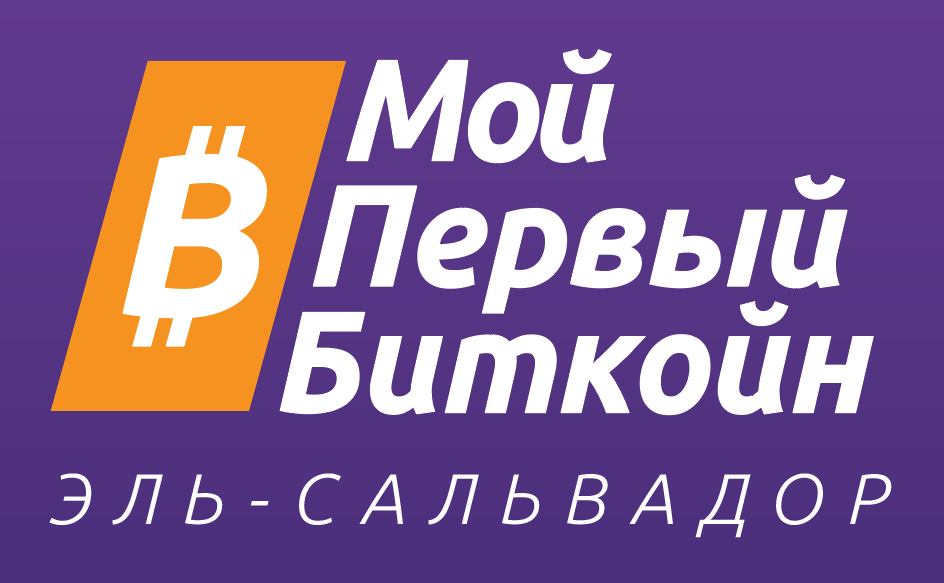
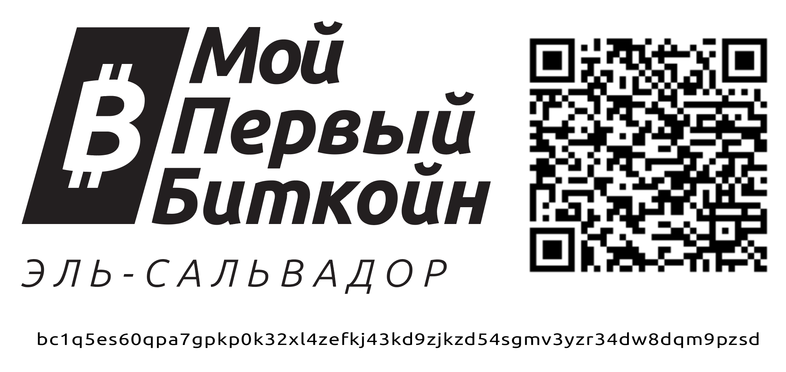

 
 

# Биткойн-Диплом    
    
### _Финансовое Образование в Эпоху Биткойна_    

 
 

### ***Рабочая Тетрадь Для Учащихся***        
Русская Версия | 2024 г.    
На Основе Английской Версии | 2024 г.    
Перевод [@BabaevDaniel on X/Twitter](https://twitter.com/BabaevDaniel)

 

__________________________________________________________________________________________________________

 

**_Мой Первый Биткойн_** создал эту работу и предоставил её    
в свободном доступе на условиях **Creative Commons**.    

Эта работа находится под лицензией     
**Creative Commons**     
**«Attribution-ShareAlike» («Атрибуция-СохранениеУсловий»)**    
**4.0 Международный (CC BY-SA 4.0)**    
 
 
 

 

__________________________________________________________________________________________________________          

 

***ПОЖЕРТВОВАЙТЕ СЕЙЧАС (сканирование с помощью биткойн-кошелька — транзакция Он-чейн):***    

       

 
 

__________________________________________________________________________________________________________              
           
 

### Благодарности    

     

***История Биткойн-Диплома***

Нет ничего более могущественного, чем идея, время которой пришло.

История Биткойн-Диплома началась в Сальвадоре, когда в июне 2022 года закончился первый пилотный проект из 38 учащихся государственных школ.

Трудно поверить, что это было всего полтора года назад.

Рост в 2023 году был феноменальным: тысячи студентов со всей страны получили дипломы о биткойна. В сентябре, всего через 15 месяцев после первого выпуска, началась гораздо более масштабная пилотная программа. Министерство образования Сальвадора создало свой собственный биткойн-диплом, используя нашу рабочую тетрадь в качестве основного исходного материала. Вместе с Bitcoin Beach наши преподаватели преподавали биткойн-диплом 150 учителям государственных школ. Эти учителя вернулись в свои школы и обучали своих учеников. В этом году мы планируем начать с помощи в обучении еще 700 учителей государственных школ, разбросанных по всей стране, и надеемся в течение двух лет обеспечить качественное биткойн-образование в каждой школе Сальвадора.

Одной из наших первоначальных целей было обучить нацию и продемонстрировать биткойн-образование как инструмент добра в массовом масштабе. Эта мечта сейчас уже в пути.

Сальвадор находится в центре внимания; миссия – это мир.

Мы открыли исходный код рабочей тетради, а также множества других образовательных материалов и были потрясены международным интересом. В 2022 году биткойн-диплом впервые преподавали в системе государственных школ в любой точке мира. В 2023 году это взорвалось. Переведенный на 12 языков, в настоящее время его преподают в Гватемале, Гондурасе, США, Канаде, Кубе, Доминиканской Республике, Южной Корее, Коста-Рике, Бразилии, Уругвае, Аргентине, Индии, Италии, Мексике, Южной Африке, Замбии, Кении, Португалии, Великобритания и Гонконг. И так же, как рост в 2023 году затмил предыдущий год, мы ожидаем, что в 2024 году произойдет то же самое.

Это глобальное децентрализованное движение.

Независимое, беспристрастное образование в области биткойна под руководством сообщества изменит мир.

 
 
 

**Для лучшего мира,**

 

**-Команда Моего Первого Биткойна-**     
**2024**
